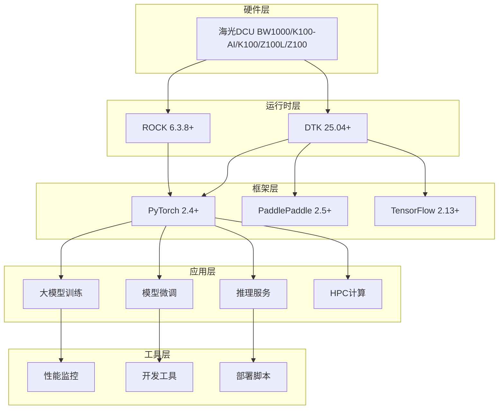

# 🚀 DCU-in-Action: 海光DCU加速卡实战指南

<div align="center">


**基于海光DCU加速卡的大模型训练、微调、推理与HPC科学计算完整实战方案**

[🚀 快速开始](#-快速开始) • [📖 教程文档](#-教程文档) • [💡 实战示例](#-实战示例) • [🛠️ 工具链](#️-核心工具链) • [🏗️ 架构设计](#️-系统架构)

</div>

---

## 📋 项目概述

DCU加速卡是一款面向科学计算与人工智能领域设计的国产加速卡，具备以下核心优势：

- 1、**架构特性：** 兼容国际主流生态（如ROCm），支持大规模并行计算与高吞吐数据处理。
- 2、**技术生态：** 覆盖虚拟化（KVM、K8s）、异构编程（HIP、OpenMP/ACC）、数学库（BLAS/FFT）等全栈工具链。
- 3、**应用场景：** 适配大模型训练（如ChatGLM3、DeepSeek）、科学计算（科学计算、AI4Science）、行业实践（金融、气象、生信）等。

DCU-in-Action 是一个面向生产环境的海光DCU加速卡完整解决方案，提供从环境搭建到模型部署的全流程工具链。项目专注于大模型应用和高性能计算，为企业级AI应用提供高性能、可扩展的基础设施。

### 🎯 核心价值

- **🔥 实战导向**：基于真实生产环境的最佳实践
- **📚 完整教程**：从入门到精通的渐进式学习路径
- **🛠️ 工具齐全**：开箱即用的开发和部署工具链
- **🚀 性能优化**：专为DCU硬件优化的高性能实现
- **🌟 持续更新**：跟踪最新技术栈和社区发展

### ✨ 核心特性

| 功能模块 | 描述 | 生产状态 | 
|----------|------|----------|
| **🤖 大模型训练** | LLaMA、ChatGLM、Qwen等预训练 | ✅ 生产就绪 |
| **🎯 模型微调** | LoRA、QLoRA、指令微调 | ✅ 生产就绪 |
| **⚡ 推理服务** | vLLM、批量推理、流式对话 | ✅ 生产就绪 |
| **🔬 HPC计算** | 科学计算、数值分析、并行计算 | ✅ 生产就绪 |
| **📊 性能监控** | 实时监控、性能分析、资源管理 | ✅ 生产就绪 |
| **🐳 容器化部署** | Docker/K8s生产环境部署 | ✅ 生产就绪 |

---

## 🏗️ 项目架构



---


### 🔧 技术栈

| 层级 | 技术组件 | 版本要求 | 用途 |
|------|----------|----------|------|
| **硬件层** | 海光DCU Z100/K100/K100-AI/BW1000 | - | 加速计算硬件 |
| **驱动层** | DCU Runtime | ≥ 5.0 | 硬件驱动和运行时 |
| **计算框架** | PyTorch | ≥ 2.0 | 深度学习框架 |
| **模型库** | Transformers | ≥ 4.30 | 预训练模型库 |
| **推理引擎** | vLLM | ≥ 0.2.0 | 高性能推理服务 |
| **微调框架** | LlamaFactory | ≥ 0.6.0 | 模型微调工具 |
| **科学计算** | NumPy/SciPy | Latest | 数值计算库 |
| **容器化** | Docker/K8s | ≥ 20.10 | 容器化部署 |

---

## 📁 项目结构

```
dcu-in-action/
├── 📁 common/                              # 🔧 核心工具库
│   ├── 📁 dcu/                            # DCU硬件管理
│   │   ├── device_manager.py              # 设备管理和监控
│   │   ├── memory_optimizer.py            # 显存优化策略
│   │   └── performance_profiler.py        # 性能分析工具
│   ├── 📁 llm/                            # 大模型工具链
│   │   ├── model_loader.py               # 模型加载和管理
│   │   ├── tokenizer_utils.py            # 分词器工具
│   │   └── training_utils.py             # 训练辅助工具
│   ├── 📁 hpc/                            # HPC计算工具
│   │   ├── parallel_utils.py             # 并行计算框架
│   │   └── numerical_solver.py           # 数值求解器
│   ├── 📁 utils/                          # 通用工具
│   │   ├── config_manager.py             # 配置管理系统
│   │   ├── logger.py                     # 统一日志系统
│   │   └── monitor.py                    # 系统监控工具
│   └── 📁 setup/                          # 环境配置
│       ├── install_dependencies.sh       # 自动依赖安装
│       └── check_environment.sh          # 环境检查脚本
├── 📁 examples/                           # 🎯 实战示例
│   ├── 📁 training/                      # 模型训练示例
│   │   ├── llama_pretraining/           # LLaMA预训练完整流程
│   │   ├── chatglm_training/            # ChatGLM训练实战
│   │   └── distributed_training/        # 分布式训练方案
│   ├── 📁 finetuning/                    # 模型微调示例
│   │   ├── llamafactory/                # LlamaFactory微调框架
│   │   ├── lora_finetuning/             # LoRA高效微调
│   │   ├── qlora_finetuning/            # QLoRA量化微调
│   │   └── instruction_tuning/          # 指令微调实战
│   ├── 📁 inference/                     # 推理服务示例
│   │   ├── vllm_serving/                # vLLM推理服务部署
│   │   ├── batch_inference/             # 批量推理优化
│   │   └── streaming_chat/              # 流式对话服务
│   ├── 📁 hpc/                          # HPC计算示例
│   │   ├── matrix_computation/          # 大规模矩阵计算
│   │   ├── pde_solving/                 # 偏微分方程求解
│   │   └── parallel_computing/          # 并行计算优化
│   └── 📁 benchmarks/                    # 性能基准测试
├── 📁 docs/                               # 📚 完整文档
│   ├── 📁 tutorials/                     # 分步教程
│   │   ├── 01-environment-setup.md       # 环境搭建指南
│   │   ├── 02-model-training.md          # 模型训练教程
│   │   ├── 03-model-finetuning.md        # 模型微调指南
│   │   ├── 04-model-inference.md         # 模型推理部署
│   │   └── 05-hpc-computing.md           # HPC计算实战
│   ├── 📁 api/                           # API参考文档
│   └── 📁 architecture/                  # 架构设计文档
├── 📁 configs/                           # ⚙️ 配置文件
│   ├── 📁 models/                       # 模型配置模板
│   ├── 📁 training/                     # 训练配置模板
│   └── 📁 inference/                    # 推理配置模板
├── 📁 scripts/                           # 🔧 自动化脚本
│   ├── 📁 setup/                        # 环境配置脚本
│   ├── 📁 deployment/                   # 部署自动化脚本
│   └── 📁 monitoring/                   # 监控脚本
├── 📁 tests/                            # 🧪 测试用例
└── 📄 README.md                        # 项目说明文档
```

---

## 🚀 快速开始

### 📋 环境要求

| 组件 | 最低要求 | 推荐配置 |
|------|----------|----------|
| **操作系统** | Ubuntu 20.04+ | Ubuntu 22.04 LTS |
| **Python** | 3.8+ | 3.10+ |
| **DCU驱动** | 5.0+ | 最新版本 |
| **内存** | 32GB | 64GB+ |
| **存储** | 500GB | 2TB+ SSD |

### ⚡ 一键安装

```bash
# 1. 克隆项目
git clone https://github.com/your-org/dcu-in-action.git
cd dcu-in-action

# 2. 自动环境检查和安装
make install

# 3. 验证安装
make test
```

### 🔧 手动安装

```bash
# 1. 检查DCU环境
./common/setup/check_environment.sh

# 2. 安装Python依赖
pip install -r requirements.txt

# 3. 安装DCU相关依赖
./common/setup/install_dependencies.sh

# 4. 配置环境变量
export DCU_VISIBLE_DEVICES=0
export PYTHONPATH=$PWD:$PYTHONPATH
```

### 🎯 快速验证

```bash
# 验证DCU设备
python -c "from common.dcu import device_manager; print(device_manager.get_device_info())"

# 运行基础示例
cd examples/basic
python hello_dcu.py

# 运行性能基准
cd examples/benchmarks
python dcu_benchmark.py
```

---

## 💡 实战示例

### 🤖 大模型训练

#### LLaMA预训练
```bash
cd examples/training/llama_pretraining
python train_llama.py --config configs/llama_7b.yaml
```

#### 分布式训练
```bash
cd examples/training/distributed_training
torchrun --nproc_per_node=4 train_distributed.py
```

### 🎯 模型微调

#### LoRA微调
```bash
cd examples/finetuning/lora_finetuning
python lora_finetune.py --model_name llama2-7b --dataset alpaca
```

#### LlamaFactory微调
```bash
cd examples/finetuning/llamafactory
llamafactory-cli train --config_path configs/lora_config.yaml
```

### ⚡ 推理服务

#### vLLM推理服务
```bash
cd examples/inference/vllm_serving
python -m vllm.entrypoints.api_server \
    --model /path/to/model \
    --tensor-parallel-size 4
```

#### 流式对话服务
```bash
cd examples/inference/streaming_chat
python chat_server.py --model_path /path/to/model
```

### 🔬 HPC科学计算

#### 大规模矩阵计算
```bash
cd examples/hpc/matrix_computation
python large_matrix_ops.py --size 10000 --precision float32
```

#### 偏微分方程求解
```bash
cd examples/hpc/pde_solving
python heat_equation_solver.py --grid_size 1024
```

---

## 🛠️ 核心工具链

### 📊 性能监控

```python
from common.utils.monitor import DCUMonitor

# 实时监控DCU使用情况
monitor = DCUMonitor()
monitor.start_monitoring()

# 获取性能报告
report = monitor.get_performance_report()
print(report)
```

### 🔧 设备管理

```python
from common.dcu.device_manager import DCUDeviceManager

# 自动设备管理
device_manager = DCUDeviceManager()
device_manager.optimize_memory()
device_manager.set_performance_mode('high')
```

### 📈 性能分析

```python
from common.dcu.performance_profiler import DCUProfiler

# 性能分析
with DCUProfiler() as profiler:
    # 你的代码
    model.forward(inputs)

# 生成性能报告
profiler.generate_report('performance_report.html')
```

---

## 📖 教程文档

### 🎓 入门教程
- [环境搭建指南](docs/tutorials/01-environment-setup.md) - 从零开始搭建DCU开发环境
- [第一个DCU程序](docs/tutorials/02-first-dcu-program.md) - Hello DCU示例

### 🚀 进阶教程
- [大模型训练实战](docs/tutorials/02-model-training.md) - 完整的模型训练流程
- [高效模型微调](docs/tutorials/03-model-finetuning.md) - LoRA/QLoRA微调技术
- [推理服务部署](docs/tutorials/04-model-inference.md) - 生产环境推理服务

### 🔬 专业教程
- [HPC科学计算](docs/tutorials/05-hpc-computing.md) - 高性能科学计算应用
- [分布式训练](docs/tutorials/06-distributed-training.md) - 大规模分布式训练
- [性能优化指南](docs/tutorials/07-performance-optimization.md) - 深度性能优化技巧

---

## 🐳 容器化部署

### Docker部署

```bash
# 构建镜像
docker build -t dcu-in-action:latest .

# 运行容器
docker run --device=/dev/kfd --device=/dev/dri \
    -v $(pwd):/workspace \
    dcu-in-action:latest
```

### Kubernetes部署

```bash
# 部署到K8s集群
kubectl apply -f k8s/

# 查看服务状态
kubectl get pods -l app=dcu-in-action
```

### Docker Compose

```bash
# 启动完整服务栈
docker-compose up -d

# 查看服务状态
docker-compose ps
```

---

## 🤝 贡献指南

我们欢迎所有形式的贡献！请阅读我们的[贡献指南](CONTRIBUTING.md)了解详情。

### 如何贡献
1. **Fork** 本项目
2. **创建** 特性分支 (`git checkout -b feature/AmazingFeature`)
3. **提交** 更改 (`git commit -m 'Add some AmazingFeature'`)
4. **推送** 到分支 (`git push origin feature/AmazingFeature`)
5. **创建** Pull Request

### 贡献类型
- 🐛 Bug修复
- ✨ 新功能开发
- 📝 文档改进
- 🎨 代码优化
- 🧪 测试用例
- 🌐 多语言支持

---
## ⚠️ 免责声明

 本项目基于海光DCU开发社区公开资料和最佳实践整理，仅供学习研究使用。
 
 - ✅ 所有代码和文档均基于公开技术资料
 - ⚠️ 请以官方最新文档为准
 - 📋 使用时请遵守相关法律法规
 - 🛡️ 项目维护者不承担使用风险

---

## 🙏 致谢

感谢以下项目和组织的支持：

<table>
<tr>
<td align="center">

<br>海光信息
</td>
<td align="center">

<br>ROCm社区
</td>
<td align="center">

<br>PyTorch
</td>
<td align="center">

<br>LLaMA Factory
</td>
</tr>
</table>


特别感谢所有贡献者和社区成员的支持！

---

<div align="center">

**⭐ 如果这个项目对您有帮助，请给个Star支持！⭐**

<a href="https://star-history.com/#FlyAIBox/dcu-in-action&Date">
  <picture>
    <source media="(prefers-color-scheme: dark)" srcset="https://api.star-history.com/svg?repos=FlyAIBox/dcu-in-action&type=Date&theme=dark" />
    <source media="(prefers-color-scheme: light)" srcset="https://api.star-history.com/svg?repos=FlyAIBox/dcu-in-action&type=Date" />
    
  </picture>
</a>

**🔗 更多DCU资源：[海光DCU开发者社区](https://developer.sourcefind.cn/)**

</div>