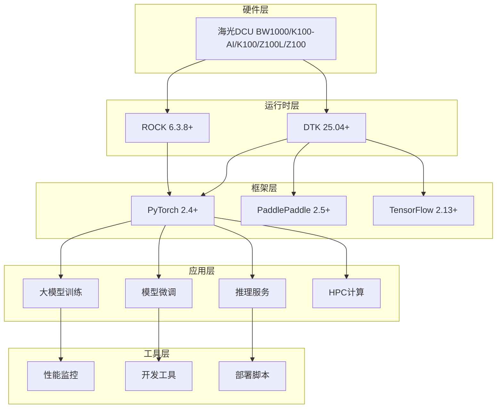

# 🚀 DCU-in-Action: 海光DCU加速卡实战指南

<div align="center">


**基于海光DCU加速卡的大模型训练、微调、推理与HPC科学计算完整实战方案**

[🚀 快速开始](#-快速开始) • [📖 教程文档](#-教程文档) • [💡 实战示例](#-实战示例) • [🛠️ 工具链](#️-核心工具链) • [🏗️ 架构设计](#️-系统架构)

</div>

---

## 📋 项目概述

DCU加速卡是一款面向科学计算与人工智能领域设计的国产加速卡，具备以下核心优势：

- 1、**架构特性：** 兼容国际主流生态（如ROCm），支持大规模并行计算与高吞吐数据处理。
- 2、**技术生态：** 覆盖虚拟化（KVM、K8s）、异构编程（HIP、OpenMP/ACC）、数学库（BLAS/FFT）等全栈工具链。
- 3、**应用场景：** 适配大模型训练（如ChatGLM3、DeepSeek）、科学计算（科学计算、AI4Science）、行业实践（金融、气象、生信）等。

DCU-in-Action 是一个面向生产环境的海光DCU加速卡完整解决方案，提供从环境搭建到模型部署的全流程工具链。项目专注于大模型应用和高性能计算，为企业级AI应用提供高性能、可扩展的基础设施。

### 🎯 核心价值

- **🔥 实战导向**：基于真实生产环境的最佳实践
- **📚 完整教程**：从入门到精通的渐进式学习路径
- **🛠️ 工具齐全**：开箱即用的开发和部署工具链
- **🚀 性能优化**：专为DCU硬件优化的高性能实现
- **🌟 持续更新**：跟踪最新技术栈和社区发展

### ✨ 核心特性

| 功能模块 | 描述 | 生产状态 | 
|----------|------|----------|
| **🤖 大模型训练** | LLaMA、DeepSeek、Qwen等预训练 | ✅ 生产就绪 |
| **🎯 模型微调** | LoRA、QLoRA、指令微调 | ✅ 生产就绪 |
| **⚡ 推理服务** | vLLM、批量推理、流式对话 | ✅ 生产就绪 |
| **🔬 HPC计算** | 科学计算、数值分析、并行计算 | ✅ 生产就绪 |
| **📊 性能监控** | 实时监控、性能分析、资源管理 | ✅ 生产就绪 |
| **🐳 容器化部署** | Docker/K8s生产环境部署 | ✅ 生产就绪 |

---
## 📚 DCU文档
### DCU基本介绍
1. [国产"芯"力量：深度解析海光DCU加速卡](https://mp.weixin.qq.com/s/l8PO6bXYbV6-QaZKkdY2Iw)
2. [善事需利器：海光DCU常用工具深度解析](https://mp.weixin.qq.com/s/5_1F7BL0OGzWcybMreHhUQ)

### DCU大模型微调
1. [实战 LLaMA Factory：在国产DCU上高效微调 Llama 3 模型](https://mp.weixin.qq.com/s/C5hUzbXbKbfT6GNFak01gQ)
2. **🚀 [DCU k100-AI专用微调指南](examples/llm-fine-tuning/llamafactory/)** - 针对海光k100-AI加速卡优化的完整大模型微调解决方案
   - **[5分钟快速入门](examples/llm-fine-tuning/llamafactory/QUICKSTART_DCU_K100_AI.md)** - 零基础快速上手
   - **[Easy Dataset + LLaMA Factory完整教程](examples/llm-fine-tuning/llamafactory/doc/LLaMA%20Factory：03-Easy%20Dataset%20让大模型高效学习领域知识.md)** - 从数据生成到模型微调的全流程
   - **[DCU k100-AI优化配置](examples/llm-fine-tuning/llamafactory/configs/dcu_k100_ai_optimal.yaml)** - 性能调优参数配置
   - **[自动环境配置脚本](examples/llm-fine-tuning/llamafactory/scripts/dcu_k100_ai_setup.sh)** - 一键配置开发环境
   - **[性能测试工具](examples/llm-fine-tuning/llamafactory/scripts/test_dcu_performance.py)** - DCU性能基准测试
---
## 🏗️ 项目架构



---


### 🔧 技术栈

| 层级 | 技术组件 | 版本要求 | 用途 |
|------|----------|----------|------|
| **硬件层** | 海光DCU Z100/K100/K100-AI/BW1000 | - | 加速计算硬件 |
| **驱动层** | DCU Runtime | ≥ 5.0 | 硬件驱动和运行时 |
| **计算框架** | PyTorch | ≥ 2.1 | 深度学习框架 |
| **模型库** | Transformers | ≥ 4.30 | 预训练模型库 |
| **推理引擎** | vLLM | ≥ 0.6.2 | 高性能推理服务 |
| **微调框架** | LlamaFactory | ≥ 0.6.0 | 模型微调工具 |
| **科学计算** | NumPy/SciPy | Latest | 数值计算库 |
| **容器化** | Docker | ≥ 20.10 | 容器化部署 |
| **容器编排** | K8s | ≥ 1.22 | 容器编排和调度 |
---

## 📁 项目结构

```
dcu-in-action/
├── 📁 common/                              # 🔧 核心工具库
│   ├── 📁 dcu/                            # DCU硬件管理
│   │   ├── device_manager.py              # 设备管理和监控
│   │   └── __init__.py                    # 模块初始化
│   ├── 📁 llm/                            # 大模型工具链
│   │   ├── training_utils.py              # 训练辅助工具
│   │   ├── finetune_utils.py              # 微调工具集
│   │   ├── inference_utils.py             # 推理工具集
│   │   └── __init__.py                    # 模块初始化
│   ├── 📁 hpc/                            # HPC计算工具
│   │   ├── numerical_solver.py            # 数值求解器
│   │   └── __init__.py                    # 模块初始化
│   ├── 📁 utils/                          # 通用工具
│   │   ├── config_manager.py             # 配置管理系统
│   │   ├── logger.py                     # 统一日志系统
│   │   ├── monitor.py                    # 系统监控工具
│   │   ├── monitor_performance.py        # 性能监控工具
│   │   └── __init__.py                   # 模块初始化
│   ├── 📁 setup/                          # 环境配置
│   │   ├── install_dependencies.sh       # 自动依赖安装
│   │   ├── install_requirements.sh       # 快速依赖安装
│   │   └── check_dcu_environment.sh          # 环境检查脚本
│   ├── 📁 docker/                         # Docker相关文件
│   └── __init__.py                       # 核心模块初始化
├── 📁 examples/                           # 🎯 实战示例
│   ├── 📁 basic/                         # 基础示例
│   ├── 📁 llm-training/                  # 大模型训练示例
│   │   ├── llama_pretraining/           # LLaMA预训练完整流程
│   │   ├── chatglm_training/            # ChatGLM训练实战
│   │   ├── distributed_training/        # 分布式训练方案
│   │   └── train_llama.py               # LLaMA训练脚本
│   ├── 📁 llm-fine-tuning/              # 大模型微调示例
│   ├── 📁 llm-inference/                # 大模型推理示例
│   │   ├── chatglm_inference.py         # ChatGLM推理示例
│   │   ├── vllm_server.py               # vLLM推理服务
│   │   └── simple_test.py               # 简单测试脚本
│   ├── 📁 llm-for-science/              # 科学计算LLM应用
│   ├── 📁 benchmarks/                    # 性能基准测试
│   ├── 📁 datasets/                      # 数据集相关
│   └── 📁 configs/                       # 示例配置文件
├── 📁 docs/                               # 📚 完整文档
│   ├── 📁 manual/                        # 手册文档
│   ├── 📁 img/                           # 图片资源
│   ├── 📁 base/                          # 基础文档
│   ├── 01-environment-setup.md           # 环境搭建指南
│   ├── 01-dcu-installation.md            # DCU安装指南
│   ├── 01-DTK安装.md                     # DTK安装指南
│   ├── 02-llm-inference.md               # 大模型推理教程
│   ├── 03-llm-fine-tuning.md             # 大模型微调教程
│   ├── 04-llm-training.md                # 大模型训练教程
│   └── 05-llm-for-science.md             # 科学计算LLM教程
├── 📄 README.md                        # 项目说明文档
├── 📄 CONTRIBUTING.md                  # 贡献指南
├── 📄 LICENSE                          # 开源协议
├── 📄 requirements.txt                 # Python依赖清单
├── 📄 requirements-full.txt            # 完整依赖清单
└── 📄 .gitignore                       # Git忽略文件配置
```

---

## 📋 环境信息
1. 产品类型 ：Rack Mount Chassis / X7850H0
2. BMC芯片型号：AST2600-A3
3. 操作系统：Ubuntu22.04.4
4. 内核：5.15.0-94-generic
5. BIOS版本号：CHH3050021
6. DCU加速卡：K100-AI
7. DCU驱动：rock-6.3.8
8. DTK：25.04
9. Python: 3.10.12
10. Conda: 22.9.0
11. Docker: 28.1.1
12. Docker Compose ：v2.35.1

## ⚡ 快速安装

### 1. 克隆项目
```bash
git clone https://github.com/your-org/dcu-in-action.git
cd dcu-in-action
```

### 2. 创建虚拟环境
```bash
# 使用 conda
conda create -n dcu_env python=3.10
conda activate dcu_env

# 或使用 venv
python -m venv dcu_env
source dcu_env/bin/activate  # Linux/Mac
# dcu_env\Scripts\activate  # Windows
```

### 3. 智能依赖安装

#### 🎯 推荐方式：使用智能安装脚本
```bash
# 一键安装（推荐标准模式）
./common/setup/install_requirements.sh --mode standard

# 仅检查环境
./common/setup/install_requirements.sh --check

# 完整安装（包含所有功能）
./common/setup/install_requirements.sh --mode full

```

#### 📦 手动安装
```bash
# 选择一种安装方式：

# 方式1：标准安装（推荐）
pip install -r requirements.txt

# 方式2：完整安装（所有功能）
pip install -r requirements-full.txt

```

### 4. DCU 深度学习特定依赖（可选）

如果您有DCU硬件环境，请下载对应的DAS优化包：

```bash
# 从官方下载页面获取DCU专用包
# https://das.sourcefind.cn:55011/portal/#/home

# 下载后安装（示例）
wget --content-disposition 'https://download.sourcefind.cn:65024/file/4/torch/DAS1.5/torch-2.4.1+das.opt2.dtk2504-cp310-cp310-manylinux_2_28_x86_64.whl'
pip install torch-2.4.1+das.opt2.dtk2504-cp310-cp310-manylinux_2_28_x86_64.whl
```

## 🎯 快速验证

### 运行基础测试
```bash
# 测试 DCU 管理器
python examples/basic/test_dcu_manager.py
```

如果看到类似以下输出，说明安装成功：
```
==================================================
DCU Manager Basic Test
==================================================
DCU Available: True
Device Count: 2
...
==================================================
Test completed successfully!
==================================================
```

### 验证安装状态
```bash
# 使用安装脚本验证
./common/setup/install_requirements.sh --check

# 手动验证关键包
python -c "import torch, transformers, fastapi; print('核心包安装成功!')"
```

### 检查生成的配置文件
```bash
cat test_config.yaml
```

## 🛠️ 核心功能

### 1. DCU 设备管理
```python
from common.dcu import DCUManager

# 初始化设备管理器
dcu = DCUManager()

# 检查设备可用性
print(f"DCU Available: {dcu.is_available()}")
print(f"Device Count: {dcu.get_device_count()}")

# 获取设备信息
devices = dcu.get_all_devices_info()
for device in devices:
    print(f"Device: {device.name}")
    print(f"Memory: {device.memory_total} MB")
```

### 2. 配置管理
```python
from common.utils import ConfigManager

# 创建配置管理器
config = ConfigManager()

# 设置配置
config.set('dcu.device_id', 0)
config.set('training.batch_size', 32)

# 获取配置
device_id = config.get('dcu.device_id')
batch_size = config.get('training.batch_size')

# 保存配置
config.save_config('my_config.yaml')
```

### 3. 性能监控
```python
from common.dcu import DCUManager

dcu = DCUManager()

# 开始监控
dcu.start_monitoring(interval=1.0)

# 获取性能摘要
summary = dcu.get_performance_summary()
print(summary)

# 停止监控
dcu.stop_monitoring()
```

---

## 💡 实战示例

### 🤖 大模型训练

#### LLaMA预训练
```bash
cd examples/llm-training/llama_pretraining
python train_llama.py --config configs/llama_7b.yaml
```

#### 分布式训练
```bash
cd examples/llm-training/distributed_training
torchrun --nproc_per_node=4 train_distributed.py
```

### 🎯 模型微调

#### LoRA微调
```bash
cd examples/llm-fine-tuning
python lora_finetune.py --model_name llama2-7b --dataset alpaca
```

#### LlamaFactory微调
```bash
cd examples/llm-fine-tuning
llamafactory-cli train --config_path configs/lora_config.yaml
```

#### 🚀 DCU k100-AI专用微调（推荐）
**专门针对海光DCU k100-AI优化的大模型微调方案**

```bash
# 1. 快速开始 - 一键配置DCU k100-AI环境
cd examples/llm-fine-tuning/llamafactory
./scripts/dcu_k100_ai_setup.sh

# 2. 启动优化的Web UI界面
~/dcu_configs/start_webui.sh
# 访问 http://localhost:7860

# 3. 使用Easy Dataset生成高质量微调数据
# 参考详细教程：
cat doc/LLaMA\ Factory：03-Easy\ Dataset\ 让大模型高效学习领域知识.md

# 4. 命令行微调（DCU优化参数）
llamafactory-cli train ~/dcu_configs/qwen2.5_3b_dcu.json

# 5. 实时监控DCU性能
~/dcu_configs/monitor_dcu.sh
```

**📊 DCU k100-AI性能优势**：
- ✅ **64GB HBM2E大显存**：支持更大模型和批处理
- ✅ **成本效益高**：提供极具竞争力的TCO
- ✅ **生态兼容性**：完整支持PyTorch生态

**📈 推荐配置**：
| 模型规模 | 批处理大小 | LoRA Rank | 预计训练时间 |
|----------|------------|-----------|------------|
| Qwen2.5-3B | 8 | 32 | 20-30分钟 |
| Qwen2.5-7B | 4 | 64 | 45-60分钟 |
| Qwen2.5-14B | 2 | 128 | 90-120分钟 |

**🔗 完整文档**：[DCU k100-AI微调指南](examples/llm-fine-tuning/llamafactory/README_DCU_K100_AI.md)

### ⚡ 推理服务

#### vLLM推理服务
```bash
cd examples/llm-inference
python vllm_server.py --model /path/to/model --tensor-parallel-size 4
```

#### ChatGLM推理
```bash
cd examples/llm-inference
python chatglm_inference.py --model_path /path/to/model
```

### 🔬 HPC科学计算

#### 科学计算LLM应用
```bash
cd examples/llm-for-science
python scientific_computing.py --task matrix_ops --size 10000
```

#### 数值求解
```bash
cd examples/llm-for-science
python numerical_analysis.py --problem pde_solving --grid_size 1024
```

---

## 🛠️ 核心工具链

### 📊 性能监控

```python
from common.utils.monitor import DCUMonitor

# 实时监控DCU使用情况
monitor = DCUMonitor()
monitor.start_monitoring()

# 获取性能报告
report = monitor.get_performance_report()
print(report)
```

### 🔧 设备管理

```python
from common.dcu.device_manager import DCUDeviceManager

# 自动设备管理
device_manager = DCUDeviceManager()
device_manager.optimize_memory()
device_manager.set_performance_mode('high')
```

### 📈 性能分析

```python
from common.dcu.performance_profiler import DCUProfiler

# 性能分析
with DCUProfiler() as profiler:
    # 你的代码
    model.forward(inputs)

# 生成性能报告
profiler.generate_report('performance_report.html')
```

---

## 📖 教程文档

### 🎓 入门教程
- [环境搭建指南](docs/01-environment-setup.md) - 从零开始搭建DCU开发环境
- [DCU安装指南](docs/01-dcu-installation.md) - DCU驱动和环境安装
- [DTK安装指南](docs/01-DTK安装.md) - DTK工具链安装配置

### 🚀 进阶教程
- [大模型训练实战](docs/04-llm-training.md) - 完整的模型训练流程
- [高效模型微调](docs/03-llm-fine-tuning.md) - LoRA/QLoRA微调技术
- [推理服务部署](docs/02-llm-inference.md) - 生产环境推理服务

### 🔬 专业教程
- [科学计算LLM应用](docs/05-llm-for-science.md) - 大模型在科学计算中的应用
- [依赖管理指南](docs/DEPENDENCIES.md) - 项目依赖和环境管理
- [快速开始指南](QUICKSTART.md) - 项目快速上手指南

---

## 🐳 容器化部署

### Docker部署

```bash
# 构建镜像
docker build -t dcu-in-action:latest .

# 运行容器
docker run --device=/dev/kfd --device=/dev/dri \
    -v $(pwd):/workspace \
    dcu-in-action:latest
```

### Kubernetes部署

```bash
# 部署到K8s集群
kubectl apply -f k8s/

# 查看服务状态
kubectl get pods -l app=dcu-in-action
```

### Docker Compose

```bash
# 启动完整服务栈
docker-compose up -d

# 查看服务状态
docker-compose ps
```

---

## 🤝 贡献指南

我们欢迎所有形式的贡献！请阅读我们的[贡献指南](CONTRIBUTING.md)了解详情。

### 如何贡献
1. **Fork** 本项目
2. **创建** 特性分支 (`git checkout -b feature/AmazingFeature`)
3. **提交** 更改 (`git commit -m 'Add some AmazingFeature'`)
4. **推送** 到分支 (`git push origin feature/AmazingFeature`)
5. **创建** Pull Request

### 贡献类型
- 🐛 Bug修复
- ✨ 新功能开发
- 📝 文档改进
- 🎨 代码优化
- 🧪 测试用例
- 🌐 多语言支持

---
## ⚠️ 免责声明

 本项目基于海光DCU开发社区公开资料和最佳实践整理，仅供学习研究使用。
 
 - ✅ 所有代码和文档均基于公开技术资料
 - ⚠️ 请以官方最新文档为准
 - 📋 使用时请遵守相关法律法规
 - 🛡️ 项目维护者不承担使用风险

---

## 🙏 致谢

感谢以下项目和组织的支持：

<table>
<tr>
<td align="center">

<br>海光信息
</td>
<td align="center">

<br>ROCm社区
</td>
<td align="center">

<br>PyTorch
</td>
<td align="center">

<br>LLaMA Factory
</td>
</tr>
</table>


特别感谢所有贡献者和社区成员的支持！

---

<div align="center">

**⭐ 如果这个项目对您有帮助，请给个Star支持！⭐**

<a href="https://star-history.com/#FlyAIBox/dcu-in-action&Date">
  <picture>
    <source media="(prefers-color-scheme: dark)" srcset="https://api.star-history.com/svg?repos=FlyAIBox/dcu-in-action&type=Date&theme=dark" />
    <source media="(prefers-color-scheme: light)" srcset="https://api.star-history.com/svg?repos=FlyAIBox/dcu-in-action&type=Date" />
    
  </picture>
</a>

**🔗 更多DCU资源：[海光DCU开发者社区](https://developer.sourcefind.cn/)**

</div>