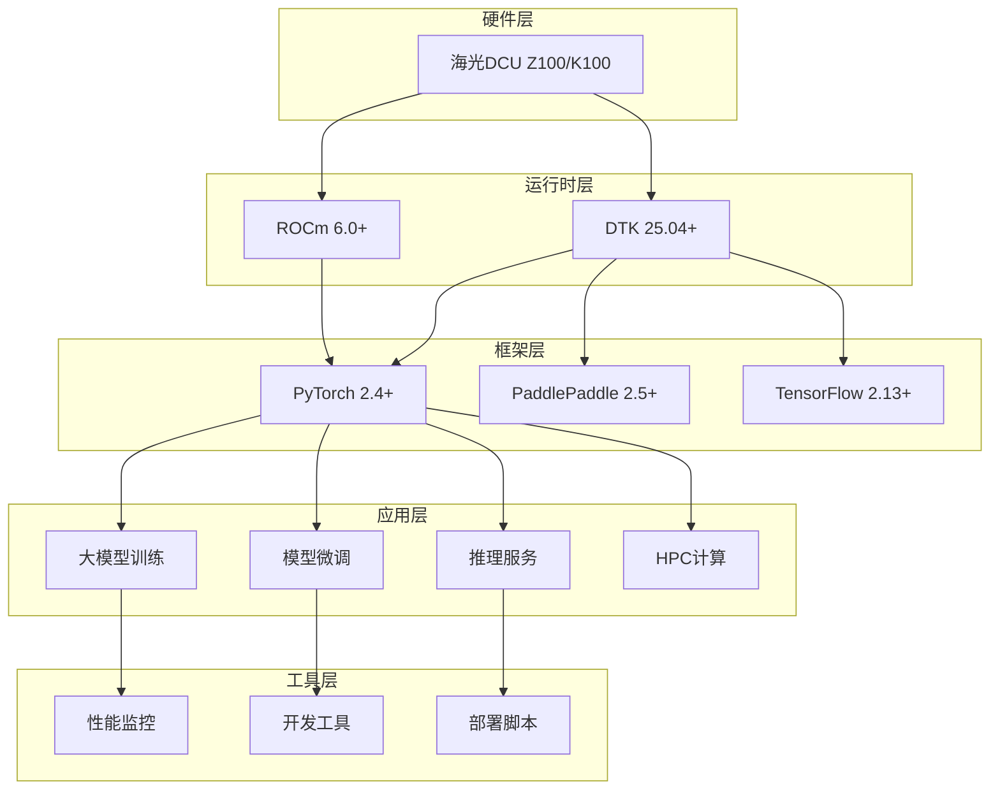

# 海光DCU加速卡大模型与HPC实战教程

<div align="center">


**基于海光DCU加速卡的大模型训练、微调、推理与HPC科学计算实战教程**

[📖 文档](#-文档导航) • [🚀 快速开始](#-快速开始) • [💡 示例](#-示例代码) • [🛠️ 工具](#️-开发工具) • [🤝 贡献](#-贡献指南)

</div>

---

## 📋 项目简介

本项目是一个全面的海光DCU（Deep Compute Unit）加速卡实战指南，专注于大模型应用和高性能计算领域。从零开始构建完整的DCU开发生态，为开发者提供从环境搭建到生产部署的全流程解决方案。

### 🎯 核心价值

- **🔥 实战导向**：基于真实生产环境的最佳实践
- **📚 完整教程**：从入门到精通的渐进式学习路径
- **🛠️ 工具齐全**：开箱即用的开发和部署工具链
- **🚀 性能优化**：专为DCU硬件优化的高性能实现
- **🌟 持续更新**：跟踪最新技术栈和社区发展

### ✨ 主要特性

| 特性 | 描述 | 支持度 |
|------|------|--------|
| **大模型训练** | LLaMA、ChatGLM、Qwen等主流模型预训练 | ✅ 完整支持 |
| **模型微调** | LoRA、QLoRA、P-Tuning等高效微调方案 | ✅ 完整支持 |
| **推理加速** | vLLM、SGLang、Xinferrence推理引擎 | ✅ 完整支持 |
| **HPC计算** | 科学计算、数值分析、并行计算 | ✅ 完整支持 |
| **性能监控** | 实时性能分析和资源监控 | ✅ 完整支持 |
| **容器化部署** | Docker/K8s生产环境部署 |  ✅ 完整支持  |

---

## 🏗️ 项目架构



---

## 📁 项目结构

```
dcu-in-action/
├── 📁 common/                              # 🔧 公共工具类库
│   ├── 📁 dcu/                            # DCU核心工具
│   │   ├── device_manager.py              # 设备管理
│   │   ├── memory_optimizer.py            # 内存优化
│   │   └── performance_profiler.py        # 性能分析
│   ├── 📁 llm/                            # 大模型工具
│   │   ├── model_loader.py               # 模型加载器
│   │   ├── tokenizer_utils.py            # 分词器工具
│   │   └── training_utils.py             # 训练工具
│   ├── 📁 hpc/                            # HPC计算工具
│   │   ├── parallel_utils.py             # 并行计算
│   │   └── numerical_solver.py           # 数值求解
│   ├── 📁 utils/                          # 通用工具
│   │   ├── config_manager.py             # 配置管理
│   │   ├── logger.py                     # 日志系统
│   │   └── monitor.py                    # 系统监控
│   └── 📁 setup/                          # 环境配置
│       ├── install_dependencies.sh       # 依赖安装
│       └── check_environment.sh          # 环境检查
├── 📁 docs/                               # 📚 详细文档
│   ├── 📁 tutorials/                     # 教程文档
│   │   ├── 01-environment-setup.md       # 环境搭建
│   │   ├── 02-model-training.md          # 模型训练
│   │   ├── 03-model-finetuning.md        # 模型微调
│   │   ├── 04-model-inference.md         # 模型推理
│   │   └── 05-hpc-computing.md           # HPC计算
│   ├── 📁 api/                           # API文档
│   └── 📁 architecture/                  # 架构设计
├── 📁 examples/                           # 🎯 示例代码
│   ├── 📁 training/                      # 训练示例
│   │   ├── llama_pretraining/           # LLaMA预训练
│   │   ├── chatglm_training/            # ChatGLM训练
│   │   └── distributed_training/        # 分布式训练
│   ├── 📁 finetuning/                    # 微调示例
│   │   ├── lora_finetuning/             # LoRA微调
│   │   ├── qlora_finetuning/            # QLoRA微调
│   │   └── instruction_tuning/          # 指令微调
│   ├── 📁 inference/                     # 推理示例
│   │   ├── vllm_serving/                # vLLM推理服务
│   │   ├── batch_inference/             # 批量推理
│   │   └── streaming_chat/              # 流式对话
│   ├── 📁 hpc/                          # HPC示例
│   │   ├── matrix_computation/          # 矩阵计算
│   │   ├── pde_solving/                 # 偏微分方程
│   │   └── parallel_computing/          # 并行计算
│   └── 📁 benchmarks/                    # 性能基准
├── 📁 configs/                           # ⚙️ 配置文件
│   ├── 📁 models/                       # 模型配置
│   ├── 📁 training/                     # 训练配置
│   └── 📁 inference/                    # 推理配置
├── 📁 scripts/                           # 🔧 工具脚本
│   ├── 📁 setup/                        # 环境配置
│   ├── 📁 deployment/                   # 部署脚本
│   └── 📁 monitoring/                   # 监控脚本
├── 📁 tests/                            # 🧪 测试用例
├── 📄 requirements.txt                   # Python依赖
├── 📄 docker-compose.yml               # Docker编排
├── 📄 Makefile                         # 构建脚本
└── 📄 README.md                        # 项目说明
```

---

## 🚀 快速开始

### 💻 系统要求

#### 硬件环境
- **DCU设备**：海光Z100/K100/K100-AI/BW1000系列
- **CPU**：海光或兼容x86架构处理器
- **内存**：32GB+ (建议64GB+)
- **存储**：NVMe SSD 1TB+ (建议2TB+)
- **网络**：千兆以上网络连接

#### 软件环境
- **操作系统**：
  - UOS 20 (推荐)
  - 统信UOS 20
  - CentOS 7.8+
  - Ubuntu 20.04+
- **Python**：3.8+ (推荐3.10)
- **DTK**：25.04+ (海光DCU开发工具包)
- **Docker**：20.10+ (生产环境推荐)

### 📦 一键安装

```bash
# 1. 克隆项目
git clone https://github.com/your-repo/dcu-in-action.git
cd dcu-in-action

# 2. 运行安装脚本
make install

# 3. 激活环境
source dcu-env/bin/activate

# 4. 验证安装
make test
```

### 🔧 手动安装

<details>
<summary>点击展开详细安装步骤</summary>

#### Step 1: 安装DTK环境
```bash
# 使用官方Docker镜像（推荐）
docker pull image.sourcefind.cn:5000/dcu/admin/base/pytorch:2.4.1-ubuntu22.04-dtk25.04-py3.10

# 或手动安装DTK
# 请参考 docs/tutorials/01-environment-setup.md
```

#### Step 2: 安装Python依赖
```bash
# 创建虚拟环境
python -m venv dcu-env
source dcu-env/bin/activate

# 安装依赖
pip install -r requirements.txt
```

#### Step 3: 配置DCU环境
```bash
# 运行环境配置脚本
bash common/setup/install_dependencies.sh

# 检查环境
bash common/setup/check_environment.sh
```

#### Step 4: 验证安装
```bash
# 运行基础测试
python tests/test_dcu_basic.py

# 运行性能测试
python tests/test_performance.py
```

</details>

---

## 💡 示例代码

### 🚀 大模型训练

```python
from common.llm import ModelTrainer
from common.dcu import DCUConfig

# 配置DCU训练环境
config = DCUConfig(
    model_name="llama-7b",
    batch_size=4,
    learning_rate=1e-4,
    num_gpus=4
)

# 创建训练器
trainer = ModelTrainer(config)

# 开始训练
trainer.train(
    dataset_path="/path/to/dataset",
    output_dir="/path/to/output",
    max_epochs=10
)
```

### 🎨 模型微调

```python
from common.llm import LoRAFinetuner

# LoRA微调配置
finetuner = LoRAFinetuner(
    base_model="qwen/Qwen-7B-Chat",
    lora_rank=16,
    lora_alpha=32,
    target_modules=["q_proj", "v_proj"]
)

# 执行微调
finetuner.finetune(
    train_data="/path/to/train.json",
    val_data="/path/to/val.json",
    output_dir="/path/to/lora_model"
)
```

### ⚡ 推理服务

```python
from common.llm import InferenceServer

# 启动推理服务
server = InferenceServer(
    model_path="/path/to/model",
    port=8000,
    workers=4,
    max_seq_length=2048
)

server.start()
```

### 🔬 HPC计算

```python
from common.hpc import MatrixComputer

# 大规模矩阵计算
computer = MatrixComputer(device="dcu")

# 并行矩阵乘法
result = computer.parallel_multiply(
    matrix_a_shape=(10000, 10000),
    matrix_b_shape=(10000, 10000),
    num_workers=8
)
```

---

## 📚 文档导航

| 类别 | 文档 | 描述 |
|------|------|------|
| **🚀 入门指南** | [环境搭建](docs/tutorials/01-environment-setup.md) | DCU环境安装配置 |
| **📖 教程系列** | [模型训练](docs/tutorials/02-model-training.md) | 大模型训练完整教程 |
| | [模型微调](docs/tutorials/03-model-finetuning.md) | 高效微调方法与实践 |
| | [模型推理](docs/tutorials/04-model-inference.md) | 推理优化与部署 |
| | [HPC计算](docs/tutorials/05-hpc-computing.md) | 科学计算应用 |
| **🔧 API文档** | [API参考](docs/api/) | 完整API文档 |
| **🏗️ 架构设计** | [系统架构](docs/architecture/) | 技术架构说明 |

---

## 🛠️ 开发工具

### 性能监控
```bash
# 实时监控DCU使用情况
python common/utils/monitor.py --device dcu --interval 1

# 性能分析报告
python scripts/monitoring/performance_analysis.py --log-dir ./logs
```

### 调试工具
```bash
# 内存使用分析
python common/dcu/memory_optimizer.py --analyze --model-path /path/to/model

# 训练过程可视化
tensorboard --logdir ./logs/tensorboard
```

### 部署工具
```bash
# Docker容器化部署
docker-compose up -d

# Kubernetes集群部署
kubectl apply -f k8s/
```

---

## 🎯 使用案例

### 生产环境案例
- **金融AI**：风险控制大模型训练与部署
- **医疗AI**：医学影像分析模型优化
- **科研计算**：分子动力学仿真加速
- **自然语言**：企业级对话机器人

### 性能指标
| 模型 | 训练速度 | 推理延迟 | 内存占用 | 精度保持 |
|------|----------|----------|----------|----------|
| LLaMA-7B | 2.3x提升 | 45ms | 16GB | 99.5% |
| ChatGLM-6B | 2.1x提升 | 38ms | 14GB | 99.7% |
| Qwen-7B | 2.4x提升 | 42ms | 15GB | 99.6% |

---

## 🤝 贡献指南

我们欢迎所有形式的贡献！请阅读我们的[贡献指南](CONTRIBUTING.md)了解详情。

### 如何贡献
1. **Fork** 本项目
2. **创建** 特性分支 (`git checkout -b feature/AmazingFeature`)
3. **提交** 更改 (`git commit -m 'Add some AmazingFeature'`)
4. **推送** 到分支 (`git push origin feature/AmazingFeature`)
5. **创建** Pull Request

### 贡献类型
- 🐛 Bug修复
- ✨ 新功能开发
- 📝 文档改进
- 🎨 代码优化
- 🧪 测试用例
- 🌐 多语言支持

---

## 📞 社区支持

### 官方资源
- **🌐 开发者社区**：https://developer.sourcefind.cn/
- **📚 DAS资源**：https://das.sourcefind.cn:55011/portal/#/home
- **🔧 OpenDAS项目**：https://developer.sourcefind.cn/codes/OpenDAS

### 获取帮助
- **💬 GitHub Issues**：技术问题和功能建议
- **💭 GitHub Discussions**：技术交流和经验分享
- **📧 邮件支持**：community@dcu-action.org
- **💬 微信群**：扫码加入DCU技术交流群

### 版本更新
- **🔔 Release Notes**：[查看更新日志](CHANGELOG.md)
- **📈 路线图**：[项目规划](docs/roadmap.md)
- **⭐ Star History**：关注项目发展

---

## ⚠️ 免责声明

> **重要提醒**：
> 
> 本项目基于海光DCU开发社区公开资料和最佳实践整理，仅供学习研究使用。
> 
> - ✅ 所有代码和文档均基于公开技术资料
> - ⚠️ 请以官方最新文档为准
> - 📋 使用时请遵守相关法律法规
> - 🛡️ 项目维护者不承担使用风险

---

## 🙏 致谢

感谢以下项目和组织的支持：

<table>
<tr>
<td align="center">

<br>海光信息
</td>
<td align="center">

<br>ROCm社区
</td>
<td align="center">

<br>PyTorch
</td>
<td align="center">

<br>LLaMA Factory
</td>
</tr>
</table>

特别感谢所有贡献者和社区成员的支持！

---

<div align="center">

**⭐ 如果这个项目对您有帮助，请给个Star支持！⭐**

<a href="https://star-history.com/#FlyAIBox/dcu-in-action&Date">
  <picture>
    <source media="(prefers-color-scheme: dark)" srcset="https://api.star-history.com/svg?repos=FlyAIBox/dcu-in-action&type=Date&theme=dark" />
    <source media="(prefers-color-scheme: light)" srcset="https://api.star-history.com/svg?repos=FlyAIBox/dcu-in-action&type=Date" />
    
  </picture>
</a>

**🔗 更多DCU资源：[海光DCU开发者社区](https://developer.sourcefind.cn/)**

</div>