# 海光DCU加速卡实战指南

<div align="center">


**基于海光DCU加速卡的大模型训练、微调、推理与HPC科学计算实战教程**

</div>

---

## 📋 项目简介

本项目是一个全面的海光DCU（Data Compute Unit）加速卡实战指南，专注于人工智能和高性能计算领域的实际应用。涵盖从环境配置到生产部署的完整流程，为海光DCU用户和大模型技术爱好者提供详细的技术文档和丰富的代码示例。

### 🎯 核心特性

- **🚀 大模型训练**：支持LLaMA、ChatGLM、Qwen等主流大模型的从零训练
- **🎨 模型微调**：提供LoRA、QLoRA、P-Tuning等高效微调方案
- **⚡ 推理加速**：集成vLLM、TensorRT等推理优化引擎
- **🔬 HPC计算**：科学计算、数值分析、并行计算示例
- **📊 性能监控**：完整的性能分析和优化工具链
- **🛠️ 开发工具**：便捷的开发环境配置和调试工具

### 🏗️ 技术架构

```mermaid
graph TB
    A[海光DCU硬件平台] --> B[DTK运行时环境]
    B --> C[深度学习框架]
    C --> D[PyTorch + ROCM]
    C --> E[PaddlePaddle]
    C --> F[TensorFlow]
    D --> G[大模型应用]
    G --> H[模型训练]
    G --> I[模型微调]
    G --> J[模型推理]
    G --> K[HPC计算]
```



---

## 📁 项目结构

```
dcu-in-action/
├── docs/                          # 📚 详细文档
│   ├── 01-dcu-installation.md     # DCU环境安装指南
│   ├── 02-llm-inference.md        # 大模型推理教程
│   ├── 03-llm-fine-tuning.md      # 大模型微调教程
│   ├── 04-llm-training.md         # 大模型训练教程
│   ├── 05-llm-for-science.md      # 科学计算应用教程
│   └── dcu/                       # DCU专用文档
├── examples/                      # 🎯 示例代码
│   ├── llm-training/              # 大模型训练示例
│   ├── llm-fine-tuning/           # 大模型微调示例
│   ├── llm-inference/             # 大模型推理示例
│   └── llm-for-science/           # 科学计算示例
├── scripts/                       # 🔧 工具脚本
│   ├── setup/                     # 环境配置脚本
│   └── utils/                     # 实用工具脚本
└── README.md                      # 📖 项目说明
```

---

## 🚀 快速开始

### 1. 环境要求

#### 硬件要求
- **DCU设备**：海光DCU Z100/K100/K100-AI系列
- **CPU**：支持海光或兼容x86架构
- **内存**：建议32GB以上
- **存储**：SSD 500GB以上

#### 软件要求
- **操作系统**：UOS 20/统信UOS/CentOS 7.8+/Ubuntu 20.04+
- **Python**：3.8+ (推荐3.10)
- **DTK**：24.04.3+ (海光DCU开发工具包)
- **Docker**：20.10+ (可选)

### 2. 安装DCU环境

```bash
# 方法一：使用官方镜像（推荐）
docker pull image.sourcefind.cn:5000/dcu/admin/base/pytorch:2.4.1-ubuntu22.04-dtk25.04-py3.10

# 方法二：手动安装DTK
# 请参考 docs/01-dcu-installation.md 详细教程
```

### 3. 克隆项目

```bash
git clone https://github.com/your-repo/dcu-in-action.git
cd dcu-in-action
```

### 4. 验证安装

```bash
# 运行环境检查脚本
bash scripts/setup/check_environment.sh

# 运行简单测试
python examples/llm-inference/simple_test.py
```

---

## 📚 应用场景与示例

### 🎯 大模型训练
- **预训练**：从零开始训练大语言模型
- **继续训练**：在现有模型基础上继续训练
- **分布式训练**：多卡多机训练加速

```bash
# 运行LLaMA-7B训练示例
cd examples/llm-training
python train_llama.py --config configs/llama_7b.yaml
```

### 🎨 模型微调
- **LoRA微调**：参数高效微调方法
- **全量微调**：完整参数微调
- **指令微调**：针对特定任务的微调

```bash
# 运行ChatGLM-6B LoRA微调
cd examples/llm-fine-tuning
python finetune_chatglm.py --model chatglm2-6b --method lora
```

### ⚡ 模型推理
- **单卡推理**：高效单卡推理部署
- **批量推理**：大批量数据处理
- **流式推理**：实时对话系统

```bash
# 启动推理服务
cd examples/llm-inference
python inference_server.py --model qwen-7b --port 8000
```

### 🔬 科学计算
- **矩阵运算**：大规模矩阵计算加速
- **数值求解**：偏微分方程数值解
- **并行计算**：MPI+DCU混合并行

```bash
# 运行科学计算示例
cd examples/llm-for-science
python matrix_computation.py --size 10000
```

---

## 🛠️ 开发工具与优化

### 性能分析工具
- **DCU性能监控**：hy-smi、rocm-smi
- **内存分析**：内存使用优化
- **计算分析**：算子性能优化

### 调试工具
- **日志系统**：完整的训练日志记录
- **可视化**：TensorBoard集成
- **错误诊断**：常见问题排查

### 优化策略
- **混合精度**：FP16/BF16训练加速
- **梯度累积**：大批次训练支持
- **检查点**：训练状态保存与恢复

---

## 📊 性能基准测试

### 训练性能
| 模型 | 批次大小 | DCU数量 | 训练速度 | 显存占用 |
|------|----------|---------|----------|----------|
| LLaMA-7B | 32 | 4 | 1.2K tokens/s | 28GB |
| ChatGLM2-6B | 16 | 2 | 800 tokens/s | 22GB |
| Qwen-7B | 24 | 4 | 1.1K tokens/s | 26GB |

### 推理性能
| 模型 | 精度 | 延迟 | 吞吐量 |
|------|------|------|--------|
| ChatGLM2-6B | FP16 | 45ms | 156 tokens/s |
| Qwen-7B | FP16 | 52ms | 142 tokens/s |
| LLaMA-7B | INT8 | 38ms | 178 tokens/s |

---

## 🤝 社区与支持

### 官方资源
- **海光DCU开发者社区**：https://developer.sourcefind.cn/
- **OpenDAS项目**：https://developer.sourcefind.cn/codes/OpenDAS
- **技术文档**：https://docs.hygon.cn/

### 问题反馈
- **Issues**：提交Bug报告和功能建议
- **讨论区**：技术交流和经验分享
- **微信群**：DCU用户交流群

### 贡献指南
欢迎提交Pull Request来完善本项目！请先阅读贡献指南：
1. Fork本项目
2. 创建特性分支
3. 提交代码变更
4. 创建Pull Request

---

## 📄 许可证

本项目采用Apache 2.0许可证 - 查看[LICENSE](LICENSE)文件了解详情。

---

## ⚠️ 免责声明

> **重要声明**：本项目资料来源于海光DCU开发社区(https://developer.sourcefind.cn/)和网络公开资料，仅用于学习和研究目的。
> 
> - 所有代码示例和文档均基于公开技术资料整理
> - 项目内容可能存在技术更新滞后，请以官方最新文档为准
> - 使用本项目进行开发时，请遵守相关法律法规和厂商协议
> - 项目维护者不对使用本项目造成的任何损失承担责任

---

## 🙏 致谢

感谢以下项目和社区的支持：
- 海光信息技术股份有限公司
- 海光DCU开发者社区
- ROCm开源社区
- PyTorch社区
- 所有贡献者和用户

---

<div align="center">

**🌟 如果本项目对您有帮助，请给我们一个Star！🌟**

[](https://star-history.com/#your-repo/dcu-in-action&Date)

</div>