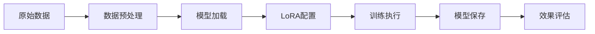

# 大模型微调理论与实践：从RAG到LLaMA-Factory的技术选择

## 引言

在人工智能快速发展的今天，企业和开发者面临一个关键问题：如何让通用大模型适应特定业务场景？目前主要有两种技术路径：检索增强生成（RAG）和模型微调（Fine-tuning）。本文将深入分析这两种方案的适用场景，并详细介绍基于LLaMA Factory的微调实践方案。

## 大模型微调的本质与价值

### 什么是大模型微调

大模型微调是在预训练语言模型的基础上，使用特定领域的数据进行二次训练，使模型获得特定能力或知识的过程。与从零开始训练相比，微调可以用较少的计算资源和数据，快速获得在特定任务上的优秀表现。

### 微调的核心价值

**1. 领域专业化**
- **知识内化**：将领域专业知识直接编码到模型参数中
- **推理能力增强**：提升模型在特定领域的逻辑推理能力
- **风格一致性**：统一模型输出的语言风格和表达方式

**2. 性能优化**
- **准确率提升**：在特定任务上显著超越通用模型
- **响应速度**：无需外部检索，直接生成答案
- **资源效率**：减少对外部知识库的依赖

**3. 商业价值**
- **知识产权保护**：核心知识集成在模型内部
- **部署灵活性**：支持离线环境和边缘计算
- **成本控制**：长期运行成本低于基于API的方案

## RAG vs 微调：技术路径的深度对比

### RAG（检索增强生成）方案分析

**优势：**
- **快速实施**：无需模型训练，部署周期短
- **知识更新**：实时更新知识库内容
- **可解释性**：检索过程透明，来源可追溯
- **资源友好**：计算需求相对较低

**局限性：**
- **检索质量依赖**：效果受检索算法和知识库质量限制
- **上下文长度约束**：受模型输入长度限制
- **推理能力受限**：难以进行复杂的跨文档推理
- **延迟增加**：检索步骤增加了响应时间

### 微调方案分析

**优势：**
- **深度定制**：模型完全适应特定领域
- **推理能力强**：具备复杂的领域内推理能力
- **响应速度快**：无检索延迟，直接生成
- **离线部署**：不依赖外部知识库

**挑战：**
- **训练成本**：需要GPU资源和训练时间
- **数据要求**：需要高质量的领域数据
- **技术门槛**：需要机器学习专业知识
- **知识更新**：更新知识需要重新训练

### 选择决策框架

```python
def choose_solution(scenario):
    """
    技术方案选择决策框架
    """
    if scenario.get('knowledge_update_frequency') == 'high':
        return 'RAG'
    
    if scenario.get('reasoning_complexity') == 'high':
        return 'Fine-tuning'
    
    if scenario.get('deployment_environment') == 'offline':
        return 'Fine-tuning'
    
    if scenario.get('development_timeline') == 'urgent':
        return 'RAG'
    
    if scenario.get('accuracy_requirement') == 'critical':
        return 'Fine-tuning'
    
    return 'Hybrid'  # 结合两种方案
```

## LLaMA Factory：微调技术的工程化实现

### 为什么选择LLaMA Factory

LLaMA Factory作为开源的大模型微调框架，具有以下显著优势：

**1. 技术先进性**
- **多种微调算法**：支持LoRA、QLoRA、P-Tuning v2等主流方法
- **模型覆盖度**：支持LLaMA、ChatGLM、Qwen、Baichuan等主流模型
- **高效训练**：集成了梯度累积、混合精度等优化技术

**2. 工程化程度**
- **一体化流程**：数据处理→训练→评估→推理完整流程
- **可视化界面**：WebUI降低使用门槛
- **配置化管理**：通过配置文件管理复杂的训练参数

**3. 生产就绪**
- **稳定性验证**：经过大量用户验证的稳定版本
- **性能优化**：针对不同硬件平台的优化
- **社区支持**：活跃的开源社区和文档支持

### LLaMA Factory的核心组件

**1. 数据处理模块**
```json
{
  "instruction": "解释什么是深度学习",
  "input": "",
  "output": "深度学习是机器学习的一个分支，它模仿人脑神经网络的结构..."
}
```

**2. 训练模块架构**


**3. 评估与推理**
- **自动评估**：集成多种评估指标
- **推理接口**：标准化的推理API
- **部署支持**：支持多种部署方式

### 核心技术特性详解

**1. LoRA（Low-Rank Adaptation）**
```python
# LoRA核心原理
# 原始权重矩阵 W ∈ R^(d×d)
# LoRA分解: ΔW = BA, 其中 B ∈ R^(d×r), A ∈ R^(r×d)
# 最终权重: W' = W + αΔW

class LoRAConfig:
    def __init__(self):
        self.r = 16              # 秩，控制参数量
        self.alpha = 32          # 缩放因子
        self.target_modules = [  # 目标模块
            "q_proj", "v_proj", "k_proj", "o_proj"
        ]
        self.dropout = 0.05      # Dropout率
```

**2. 数据格式标准化**
```python
# LLaMA Factory支持的数据格式
SUPPORTED_FORMATS = {
    "alpaca": {
        "columns": ["instruction", "input", "output"],
        "tags": {"prompt": "instruction", "response": "output"}
    },
    "sharegpt": {
        "columns": ["conversations"],
        "tags": {"role": "from", "content": "value"}
    }
}
```

## 企业级应用场景分析

### 客服智能化改造

**场景描述：**
传统客服系统需要升级为智能客服，要求准确理解业务术语、政策条款，并提供专业回答。

**技术方案：**
```yaml
# 客服微调配置示例
model_name: chatglm3-6b
dataset: customer_service_qa
training_args:
  learning_rate: 5.0e-5
  num_train_epochs: 3
  per_device_train_batch_size: 4
  gradient_accumulation_steps: 8
lora_config:
  r: 16
  alpha: 32
  target_modules: ["query_key_value", "dense"]
```

**效果预期：**
- 业务问题识别准确率：85%→95%
- 平均响应时间：30s→3s
- 人工干预率：60%→15%

### 金融风控模型

**场景描述：**
基于历史风控案例训练专业的风险评估模型，要求具备复杂的风险推理能力。

**数据准备：**
```python
# 风控数据格式化
def format_risk_data(raw_data):
    formatted = []
    for case in raw_data:
        formatted.append({
            "instruction": "分析以下客户信息的信贷风险",
            "input": f"年龄:{case['age']}, 收入:{case['income']}, "
                    f"征信记录:{case['credit_history']}",
            "output": f"风险等级:{case['risk_level']}, "
                     f"建议:{case['recommendation']}"
        })
    return formatted
```

### 法律文档分析

**场景描述：**
训练专业的法律文档分析模型，要求准确理解法律条文和案例。

**微调策略：**
```python
# 法律领域特化配置
LEGAL_DOMAIN_CONFIG = {
    "base_model": "qwen-14b",
    "domain_data": [
        "legal_cases.json",      # 案例数据
        "law_articles.json",     # 法条数据
        "legal_qa.json"          # 问答数据
    ],
    "training_strategy": {
        "stage1": "general_legal_knowledge",  # 通用法律知识
        "stage2": "specialized_areas",        # 专业领域
        "stage3": "case_reasoning"            # 案例推理
    }
}
```

## 投资回报分析

### 成本构成

**初期投资：**
- 硬件设备：GPU服务器或云计算资源
- 人力成本：机器学习工程师、数据工程师
- 数据准备：标注成本、清洗成本
- 开发周期：通常2-6个月

**运营成本：**
- 推理硬件：相比训练硬件需求较低
- 维护成本：模型更新、性能监控
- 人力成本：持续优化和维护

### 收益评估

**直接收益：**
- 人力成本节约：减少人工客服、分析师等
- 效率提升：处理速度和准确率提升
- 规模扩展：无人力瓶颈的业务扩展

**间接收益：**
- 服务质量：7×24小时稳定服务
- 数据价值：训练过程产生的数据洞察
- 技术积累：形成企业的AI技术壁垒

### ROI计算模型

```python
def calculate_roi(scenario):
    """
    微调项目ROI计算
    """
    # 成本计算
    hardware_cost = scenario['gpu_hours'] * scenario['gpu_price']
    labor_cost = scenario['engineer_months'] * scenario['monthly_salary']
    data_cost = scenario['data_volume'] * scenario['annotation_price']
    total_cost = hardware_cost + labor_cost + data_cost
    
    # 收益计算
    labor_saving = scenario['automated_tasks'] * scenario['task_value']
    efficiency_gain = scenario['process_speedup'] * scenario['time_value']
    total_benefit = labor_saving + efficiency_gain
    
    # ROI计算
    roi = (total_benefit - total_cost) / total_cost * 100
    payback_period = total_cost / (total_benefit / 12)  # 月为单位
    
    return {
        'roi_percentage': roi,
        'payback_months': payback_period,
        'total_cost': total_cost,
        'annual_benefit': total_benefit
    }
```

## 技术决策建议

### 对于AI企业技术决策者

**1. 评估关键指标**
- 数据资产质量和规模
- 技术团队能力
- 业务场景复杂度
- 预期投资回报

**2. 分阶段实施策略**
```python
IMPLEMENTATION_PHASES = {
    "Phase1": {
        "目标": "验证可行性",
        "周期": "1-2个月",
        "投入": "小规模团队",
        "成果": "概念验证"
    },
    "Phase2": {
        "目标": "生产级实现",
        "周期": "3-6个月", 
        "投入": "完整团队",
        "成果": "业务上线"
    },
    "Phase3": {
        "目标": "规模化应用",
        "周期": "6-12个月",
        "投入": "持续优化",
        "成果": "全面部署"
    }
}
```

### 对于技术创业者

**1. 技术选型建议**
- 优先选择开源方案降低成本
- 关注社区活跃度和文档完善程度
- 考虑硬件兼容性和部署便利性

**2. 团队建设要点**
- 机器学习工程师：负责模型训练和优化
- 数据工程师：负责数据处理和管道
- 后端工程师：负责推理服务和API
- 产品经理：负责需求分析和效果评估

## 结论

大模型微调技术正在从学术研究走向产业应用，LLaMA Factory等工程化框架的出现大大降低了应用门槛。对于企业而言，选择RAG还是微调不是非此即彼的问题，而是要根据具体场景选择最适合的技术路径，甚至可以将两者结合使用。

微调技术的核心价值在于将领域知识深度集成到模型中，形成真正的"领域专家"。随着硬件成本的下降和框架的完善，微调将成为企业AI化的重要技术选择。

在下一篇文章中，我们将详细介绍LLaMA Factory的实战操作，包括环境配置、数据准备、模型训练、效果评估等完整流程，并提供可运行的代码示例。

---

*作者：[您的姓名]*  
*发布时间：[当前日期]*  
*本文为原创技术分析文章，转载请注明出处* 