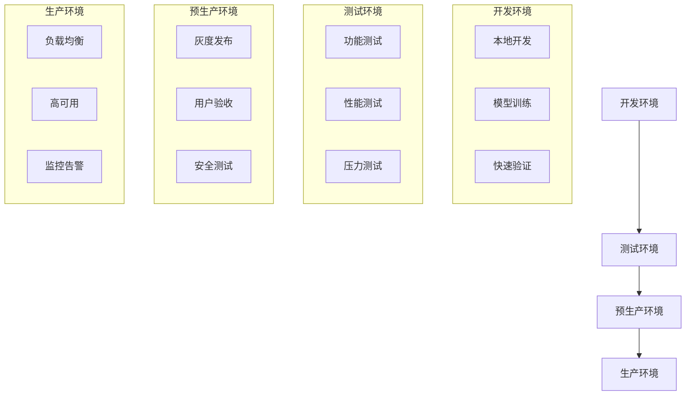

# 大模型微调部署指南：从开发到生产的完整解决方案

## 概述

本文档提供了大模型微调项目从开发环境到生产环境的完整部署指南，涵盖本地部署、云端部署、容器化部署和Kubernetes集群部署等多种方案。

## 部署架构概览



## 一、本地开发部署

### 1.1 快速开始

```bash
# 克隆项目
git clone <repository_url>
cd dcu-in-action

# 一键启动客服场景微调
./scripts/quick_start.sh customer-service

# 或分步执行
./scripts/quick_start.sh -e customer-service  # 仅安装环境
./scripts/quick_start.sh -d customer-service  # 仅处理数据
./scripts/quick_start.sh -t customer-service  # 仅训练模型
```

### 1.2 开发环境配置

```bash
# 安装开发依赖
pip install -r requirements-dev.txt

# 配置环境变量
export MODEL_PATH="/path/to/your/model"
export CUDA_VISIBLE_DEVICES=0
export PYTHONPATH="${PYTHONPATH}:$(pwd)"

# 启动开发服务
python scripts/llamafactory/inference_server.py \
    --model_path $MODEL_PATH \
    --host localhost \
    --port 8000 \
    --log_level debug
```

### 1.3 开发工具配置

```yaml
# .vscode/settings.json
{
    "python.defaultInterpreterPath": "./llamafactory_env/bin/python",
    "python.linting.enabled": true,
    "python.linting.pylintEnabled": true,
    "python.formatting.provider": "black",
    "python.terminal.activateEnvironment": true
}
```

## 二、Docker容器化部署

### 2.1 构建Docker镜像

```dockerfile
# Dockerfile.inference
FROM nvidia/cuda:11.8-devel-ubuntu20.04

# 设置环境变量
ENV DEBIAN_FRONTEND=noninteractive
ENV PYTHONUNBUFFERED=1
ENV MODEL_PATH=/app/model

# 安装系统依赖
RUN apt-get update && apt-get install -y \
    python3 \
    python3-pip \
    git \
    wget \
    curl \
    && rm -rf /var/lib/apt/lists/*

# 设置工作目录
WORKDIR /app

# 复制依赖文件
COPY requirements.txt .
RUN pip3 install --no-cache-dir -r requirements.txt

# 复制应用代码
COPY scripts/ ./scripts/
COPY examples/ ./examples/

# 复制模型（可选，也可以通过挂载卷）
# COPY models/ ./models/

# 健康检查
HEALTHCHECK --interval=30s --timeout=10s --start-period=60s --retries=3 \
    CMD curl -f http://localhost:8000/health || exit 1

# 暴露端口
EXPOSE 8000

# 启动命令
CMD ["python3", "scripts/llamafactory/inference_server.py", \
     "--model_path", "/app/model", \
     "--host", "0.0.0.0", \
     "--port", "8000"]
```

### 2.2 Docker Compose部署

```yaml
# docker-compose.yml
version: '3.8'

services:
  llama-inference:
    build:
      context: .
      dockerfile: Dockerfile.inference
    ports:
      - "8000:8000"
    volumes:
      - ./models:/app/model:ro
      - ./logs:/app/logs
    environment:
      - MODEL_PATH=/app/model
      - CUDA_VISIBLE_DEVICES=0
    runtime: nvidia
    restart: unless-stopped
    healthcheck:
      test: ["CMD", "curl", "-f", "http://localhost:8000/health"]
      interval: 30s
      timeout: 10s
      retries: 3
      start_period: 60s

  nginx:
    image: nginx:alpine
    ports:
      - "80:80"
      - "443:443"
    volumes:
      - ./nginx.conf:/etc/nginx/nginx.conf:ro
      - ./ssl:/etc/ssl:ro
    depends_on:
      - llama-inference
    restart: unless-stopped

  prometheus:
    image: prom/prometheus
    ports:
      - "9090:9090"
    volumes:
      - ./prometheus.yml:/etc/prometheus/prometheus.yml:ro
    restart: unless-stopped

  grafana:
    image: grafana/grafana
    ports:
      - "3000:3000"
    environment:
      - GF_SECURITY_ADMIN_PASSWORD=admin
    volumes:
      - grafana-storage:/var/lib/grafana
    restart: unless-stopped

volumes:
  grafana-storage:
```

### 2.3 构建和运行

```bash
# 构建镜像
docker build -f Dockerfile.inference -t llama-inference:latest .

# 运行容器
docker run -d \
    --name llama-inference \
    --gpus all \
    -p 8000:8000 \
    -v $(pwd)/models:/app/model:ro \
    -v $(pwd)/logs:/app/logs \
    -e MODEL_PATH=/app/model \
    llama-inference:latest

# 使用Docker Compose
docker-compose up -d

# 查看日志
docker-compose logs -f llama-inference
```

## 三、Kubernetes集群部署

### 3.1 命名空间和资源配置

```yaml
# namespace.yaml
apiVersion: v1
kind: Namespace
metadata:
  name: llama-factory
  labels:
    name: llama-factory
---
# configmap.yaml
apiVersion: v1
kind: ConfigMap
metadata:
  name: llama-config
  namespace: llama-factory
data:
  MODEL_PATH: "/models/merged_model"
  LOG_LEVEL: "info"
  MAX_WORKERS: "4"
---
# secret.yaml
apiVersion: v1
kind: Secret
metadata:
  name: llama-secrets
  namespace: llama-factory
type: Opaque
data:
  api-key: <base64-encoded-api-key>
```

### 3.2 持久化存储

```yaml
# pv-pvc.yaml
apiVersion: v1
kind: PersistentVolume
metadata:
  name: model-storage-pv
spec:
  capacity:
    storage: 100Gi
  volumeMode: Filesystem
  accessModes:
    - ReadOnlyMany
  persistentVolumeReclaimPolicy: Retain
  storageClassName: fast-ssd
  hostPath:
    path: /data/models
---
apiVersion: v1
kind: PersistentVolumeClaim
metadata:
  name: model-storage-pvc
  namespace: llama-factory
spec:
  accessModes:
    - ReadOnlyMany
  volumeMode: Filesystem
  resources:
    requests:
      storage: 100Gi
  storageClassName: fast-ssd
```

### 3.3 应用部署

```yaml
# deployment.yaml
apiVersion: apps/v1
kind: Deployment
metadata:
  name: llama-inference
  namespace: llama-factory
  labels:
    app: llama-inference
spec:
  replicas: 3
  selector:
    matchLabels:
      app: llama-inference
  template:
    metadata:
      labels:
        app: llama-inference
    spec:
      containers:
      - name: inference
        image: llama-inference:latest
        ports:
        - containerPort: 8000
          name: http
        envFrom:
        - configMapRef:
            name: llama-config
        - secretRef:
            name: llama-secrets
        resources:
          requests:
            nvidia.com/gpu: 1
            memory: "16Gi"
            cpu: "4"
          limits:
            nvidia.com/gpu: 1
            memory: "32Gi"
            cpu: "8"
        volumeMounts:
        - name: model-storage
          mountPath: /models
          readOnly: true
        livenessProbe:
          httpGet:
            path: /health
            port: 8000
          initialDelaySeconds: 120
          periodSeconds: 30
          timeoutSeconds: 10
          failureThreshold: 3
        readinessProbe:
          httpGet:
            path: /health
            port: 8000
          initialDelaySeconds: 60
          periodSeconds: 10
          timeoutSeconds: 5
          failureThreshold: 3
      volumes:
      - name: model-storage
        persistentVolumeClaim:
          claimName: model-storage-pvc
      nodeSelector:
        gpu: "true"
      tolerations:
      - key: nvidia.com/gpu
        operator: Exists
        effect: NoSchedule
```

### 3.4 服务和Ingress

```yaml
# service.yaml
apiVersion: v1
kind: Service
metadata:
  name: llama-inference-service
  namespace: llama-factory
  labels:
    app: llama-inference
spec:
  selector:
    app: llama-inference
  ports:
  - name: http
    port: 80
    targetPort: 8000
    protocol: TCP
  type: ClusterIP
---
# ingress.yaml
apiVersion: networking.k8s.io/v1
kind: Ingress
metadata:
  name: llama-inference-ingress
  namespace: llama-factory
  annotations:
    nginx.ingress.kubernetes.io/rewrite-target: /
    nginx.ingress.kubernetes.io/proxy-read-timeout: "300"
    nginx.ingress.kubernetes.io/proxy-send-timeout: "300"
    nginx.ingress.kubernetes.io/client-max-body-size: "50m"
    cert-manager.io/cluster-issuer: "letsencrypt-prod"
spec:
  tls:
  - hosts:
    - api.your-domain.com
    secretName: llama-tls-secret
  rules:
  - host: api.your-domain.com
    http:
      paths:
      - path: /
        pathType: Prefix
        backend:
          service:
            name: llama-inference-service
            port:
              number: 80
```

### 3.5 水平自动扩缩容

```yaml
# hpa.yaml
apiVersion: autoscaling/v2
kind: HorizontalPodAutoscaler
metadata:
  name: llama-inference-hpa
  namespace: llama-factory
spec:
  scaleTargetRef:
    apiVersion: apps/v1
    kind: Deployment
    name: llama-inference
  minReplicas: 2
  maxReplicas: 10
  metrics:
  - type: Resource
    resource:
      name: cpu
      target:
        type: Utilization
        averageUtilization: 70
  - type: Resource
    resource:
      name: memory
      target:
        type: Utilization
        averageUtilization: 80
  behavior:
    scaleDown:
      stabilizationWindowSeconds: 300
      policies:
      - type: Pods
        value: 1
        periodSeconds: 60
    scaleUp:
      stabilizationWindowSeconds: 60
      policies:
      - type: Pods
        value: 2
        periodSeconds: 60
```

## 四、云端部署方案

### 4.1 AWS部署

```yaml
# aws-eks-deployment.yaml
apiVersion: v1
kind: ConfigMap
metadata:
  name: aws-config
data:
  AWS_REGION: "us-west-2"
  S3_BUCKET: "your-model-bucket"
  CLOUDWATCH_LOG_GROUP: "/aws/lambda/llama-inference"
---
# 使用AWS Load Balancer Controller
apiVersion: v1
kind: Service
metadata:
  name: llama-service-nlb
  annotations:
    service.beta.kubernetes.io/aws-load-balancer-type: "nlb"
    service.beta.kubernetes.io/aws-load-balancer-scheme: "internet-facing"
spec:
  type: LoadBalancer
  selector:
    app: llama-inference
  ports:
  - port: 80
    targetPort: 8000
```

### 4.2 阿里云部署

```yaml
# aliyun-ack-deployment.yaml
apiVersion: v1
kind: Service
metadata:
  name: llama-service-slb
  annotations:
    service.beta.kubernetes.io/alicloud-loadbalancer-spec: "slb.s3.medium"
    service.beta.kubernetes.io/alicloud-loadbalancer-charge-type: "paybytraffic"
spec:
  type: LoadBalancer
  selector:
    app: llama-inference
  ports:
  - port: 80
    targetPort: 8000
```

### 4.3 腾讯云部署

```bash
#!/bin/bash
# tencent-cloud-deploy.sh

# 创建TKE集群
tccli tke CreateCluster \
    --region ap-beijing \
    --ClusterType MANAGED_CLUSTER \
    --ClusterName llama-cluster \
    --VpcId vpc-xxx \
    --SubnetId subnet-xxx

# 部署应用
kubectl apply -f k8s-manifests/
```

## 五、监控和日志系统

### 5.1 Prometheus监控配置

```yaml
# prometheus.yml
global:
  scrape_interval: 15s
  evaluation_interval: 15s

rule_files:
  - "alert_rules.yml"

scrape_configs:
  - job_name: 'llama-inference'
    static_configs:
      - targets: ['llama-inference-service:80']
    metrics_path: '/metrics'
    scrape_interval: 30s

  - job_name: 'kubernetes-pods'
    kubernetes_sd_configs:
      - role: pod
    relabel_configs:
      - source_labels: [__meta_kubernetes_pod_annotation_prometheus_io_scrape]
        action: keep
        regex: true

alerting:
  alertmanagers:
    - static_configs:
        - targets:
          - alertmanager:9093
```

### 5.2 Grafana仪表板

```json
{
  "dashboard": {
    "id": null,
    "title": "LLaMA Factory Inference Metrics",
    "panels": [
      {
        "title": "Request Rate",
        "type": "graph",
        "targets": [
          {
            "expr": "rate(http_requests_total[5m])",
            "legendFormat": "{{method}} {{status}}"
          }
        ]
      },
      {
        "title": "Response Time",
        "type": "graph",
        "targets": [
          {
            "expr": "histogram_quantile(0.95, rate(http_request_duration_seconds_bucket[5m]))",
            "legendFormat": "95th percentile"
          }
        ]
      },
      {
        "title": "GPU Utilization",
        "type": "graph",
        "targets": [
          {
            "expr": "nvidia_gpu_utilization",
            "legendFormat": "GPU {{gpu}}"
          }
        ]
      }
    ]
  }
}
```

### 5.3 日志聚合配置

```yaml
# fluentd-config.yaml
apiVersion: v1
kind: ConfigMap
metadata:
  name: fluentd-config
data:
  fluent.conf: |
    <source>
      @type tail
      path /var/log/containers/*llama-inference*.log
      pos_file /var/log/fluentd-llama.log.pos
      tag kubernetes.*
      format json
      time_format %Y-%m-%dT%H:%M:%S.%NZ
    </source>
    
    <match kubernetes.**>
      @type elasticsearch
      host elasticsearch.logging.svc.cluster.local
      port 9200
      index_name llama-logs
      type_name _doc
    </match>
```

## 六、安全配置

### 6.1 网络安全

```yaml
# network-policy.yaml
apiVersion: networking.k8s.io/v1
kind: NetworkPolicy
metadata:
  name: llama-network-policy
  namespace: llama-factory
spec:
  podSelector:
    matchLabels:
      app: llama-inference
  policyTypes:
  - Ingress
  - Egress
  ingress:
  - from:
    - namespaceSelector:
        matchLabels:
          name: nginx-ingress
    - podSelector:
        matchLabels:
          app: nginx
    ports:
    - protocol: TCP
      port: 8000
  egress:
  - to: []
    ports:
    - protocol: TCP
      port: 80
    - protocol: TCP
      port: 443
```

### 6.2 RBAC权限控制

```yaml
# rbac.yaml
apiVersion: v1
kind: ServiceAccount
metadata:
  name: llama-service-account
  namespace: llama-factory
---
apiVersion: rbac.authorization.k8s.io/v1
kind: Role
metadata:
  name: llama-role
  namespace: llama-factory
rules:
- apiGroups: [""]
  resources: ["configmaps", "secrets"]
  verbs: ["get", "list"]
- apiGroups: [""]
  resources: ["pods"]
  verbs: ["get", "list", "watch"]
---
apiVersion: rbac.authorization.k8s.io/v1
kind: RoleBinding
metadata:
  name: llama-role-binding
  namespace: llama-factory
subjects:
- kind: ServiceAccount
  name: llama-service-account
  namespace: llama-factory
roleRef:
  kind: Role
  name: llama-role
  apiGroup: rbac.authorization.k8s.io
```

### 6.3 Pod安全策略

```yaml
# pod-security-policy.yaml
apiVersion: policy/v1beta1
kind: PodSecurityPolicy
metadata:
  name: llama-psp
spec:
  privileged: false
  allowPrivilegeEscalation: false
  requiredDropCapabilities:
    - ALL
  volumes:
    - 'configMap'
    - 'emptyDir'
    - 'projected'
    - 'secret'
    - 'downwardAPI'
    - 'persistentVolumeClaim'
  runAsUser:
    rule: 'MustRunAsNonRoot'
  seLinux:
    rule: 'RunAsAny'
  fsGroup:
    rule: 'RunAsAny'
```

## 七、CI/CD流水线

### 7.1 GitHub Actions配置

```yaml
# .github/workflows/deploy.yml
name: Deploy LLaMA Factory

on:
  push:
    branches: [main]
  pull_request:
    branches: [main]

jobs:
  test:
    runs-on: ubuntu-latest
    steps:
    - uses: actions/checkout@v3
    
    - name: Set up Python
      uses: actions/setup-python@v4
      with:
        python-version: '3.9'
    
    - name: Install dependencies
      run: |
        pip install -r requirements.txt
        pip install pytest
    
    - name: Run tests
      run: pytest tests/

  build:
    needs: test
    runs-on: ubuntu-latest
    if: github.ref == 'refs/heads/main'
    
    steps:
    - uses: actions/checkout@v3
    
    - name: Build Docker image
      run: |
        docker build -f Dockerfile.inference -t ${{ secrets.REGISTRY }}/llama-inference:${{ github.sha }} .
    
    - name: Push to registry
      run: |
        echo ${{ secrets.REGISTRY_PASSWORD }} | docker login ${{ secrets.REGISTRY }} -u ${{ secrets.REGISTRY_USERNAME }} --password-stdin
        docker push ${{ secrets.REGISTRY }}/llama-inference:${{ github.sha }}

  deploy:
    needs: build
    runs-on: ubuntu-latest
    if: github.ref == 'refs/heads/main'
    
    steps:
    - uses: actions/checkout@v3
    
    - name: Deploy to Kubernetes
      run: |
        echo "${{ secrets.KUBECONFIG }}" | base64 -d > kubeconfig
        export KUBECONFIG=kubeconfig
        
        # Update image in deployment
        kubectl set image deployment/llama-inference \
          inference=${{ secrets.REGISTRY }}/llama-inference:${{ github.sha }} \
          -n llama-factory
        
        # Wait for rollout
        kubectl rollout status deployment/llama-inference -n llama-factory
```

### 7.2 Jenkins Pipeline

```groovy
// Jenkinsfile
pipeline {
    agent any
    
    environment {
        REGISTRY = credentials('docker-registry')
        KUBECONFIG = credentials('kubeconfig')
    }
    
    stages {
        stage('Checkout') {
            steps {
                checkout scm
            }
        }
        
        stage('Test') {
            steps {
                sh '''
                    python -m venv venv
                    source venv/bin/activate
                    pip install -r requirements.txt
                    pytest tests/
                '''
            }
        }
        
        stage('Build') {
            steps {
                sh '''
                    docker build -f Dockerfile.inference -t llama-inference:${BUILD_NUMBER} .
                '''
            }
        }
        
        stage('Deploy to Staging') {
            steps {
                sh '''
                    kubectl set image deployment/llama-inference \
                      inference=llama-inference:${BUILD_NUMBER} \
                      -n llama-factory-staging
                '''
            }
        }
        
        stage('Deploy to Production') {
            when {
                branch 'main'
            }
            steps {
                sh '''
                    kubectl set image deployment/llama-inference \
                      inference=llama-inference:${BUILD_NUMBER} \
                      -n llama-factory
                '''
            }
        }
    }
    
    post {
        always {
            cleanWs()
        }
        failure {
            emailext (
                subject: "Build Failed: ${env.JOB_NAME} - ${env.BUILD_NUMBER}",
                body: "Build failed. Check Jenkins for details.",
                to: "${env.CHANGE_AUTHOR_EMAIL}"
            )
        }
    }
}
```

## 八、性能优化和故障排除

### 8.1 性能优化策略

```bash
# 1. GPU内存优化
export PYTORCH_CUDA_ALLOC_CONF=max_split_size_mb:128

# 2. 模型量化
python scripts/llamafactory/quantize_model.py \
    --model_path ./merged_model \
    --quantization_type int8 \
    --output_path ./quantized_model

# 3. 批处理优化
python scripts/llamafactory/inference_server.py \
    --model_path ./merged_model \
    --max_batch_size 16 \
    --batch_timeout 50ms
```

### 8.2 常见问题排查

```bash
# 检查Pod状态
kubectl get pods -n llama-factory
kubectl describe pod llama-inference-xxx -n llama-factory

# 查看日志
kubectl logs -f llama-inference-xxx -n llama-factory

# 检查资源使用
kubectl top pods -n llama-factory
kubectl top nodes

# 网络连通性测试
kubectl exec -it llama-inference-xxx -n llama-factory -- curl http://localhost:8000/health

# GPU状态检查
kubectl exec -it llama-inference-xxx -n llama-factory -- nvidia-smi
```

### 8.3 告警规则配置

```yaml
# alert-rules.yml
groups:
- name: llama-factory-alerts
  rules:
  - alert: HighErrorRate
    expr: rate(http_requests_total{status=~"5.."}[5m]) > 0.1
    for: 5m
    labels:
      severity: critical
    annotations:
      summary: "High error rate detected"
      description: "Error rate is above 10% for 5 minutes"

  - alert: HighLatency
    expr: histogram_quantile(0.95, rate(http_request_duration_seconds_bucket[5m])) > 2
    for: 5m
    labels:
      severity: warning
    annotations:
      summary: "High latency detected"
      description: "95th percentile latency is above 2 seconds"

  - alert: GPUMemoryHigh
    expr: nvidia_gpu_memory_used_bytes / nvidia_gpu_memory_total_bytes > 0.9
    for: 2m
    labels:
      severity: warning
    annotations:
      summary: "GPU memory usage high"
      description: "GPU memory usage is above 90%"
```

## 结论

本部署指南提供了从开发到生产的完整部署方案，涵盖了容器化、Kubernetes集群、云端部署、监控告警等各个方面。通过这些配置和脚本，您可以：

1. **快速搭建开发环境**：使用快速开始脚本一键配置
2. **标准化生产部署**：使用Kubernetes实现高可用部署
3. **完善监控体系**：集成Prometheus、Grafana等监控工具
4. **确保系统安全**：配置网络策略、RBAC等安全措施
5. **实现自动化运维**：通过CI/CD流水线实现自动部署

选择适合您业务场景的部署方案，并根据实际需求进行调整和优化。

---

*本指南将随着技术发展持续更新，如有问题或建议，欢迎反馈。* 