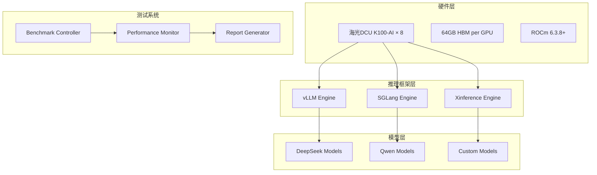

# 🚀 海光DCU K100-AI大模型推理基准测试系统

> **版本**：v2.0   **最后更新**：2024-12-19
>
> 本文档提供海光DCU K100-AI加速卡上进行大模型推理测评的完整解决方案，涵盖**vLLM、SGLang、Xinference**三大推理框架，支持**DeepSeek、Qwen**等主流开源模型的性能基准测试。

---

## 🎯 项目概述

### 核心功能
- **🔧 多框架支持**：vLLM、SGLang、Xinference
- **📊 全面评估**：单卡/8卡吞吐量、并发能力、延迟分析
- **⚡ 性能优化**：自动化优化建议、硬件监控
- **📈 可视化报告**：详细的性能分析报告
- **🛠️ 自动化测试**：完整的CI/CD测试流程

### 测试维度
| 维度 | 指标 | 说明 |
|------|------|------|
| **吞吐量** | tokens/s | 每秒处理的token数量 |
| **延迟** | ms | P50/P90/P99响应时间 |
| **并发能力** | concurrent requests | 最大支持并发数 |
| **资源利用率** | GPU/CPU/Memory % | 硬件资源使用情况 |
| **功耗效率** | tokens/J | 每焦耳能处理的token数 |

---

## 🏗️ 系统架构



---

## 📋 测试环境规范

### 硬件配置
| 组件 | 规格 | 要求 |
|------|------|------|
| **加速卡** | 海光DCU K100-AI × 8 | 64GB HBM, PCIe 4.0 ×16 |
| **CPU** | 2×64C AMD EPYC 7T83 | NUMA优化 |
| **内存** | 512GB DDR4-3200 | ECC支持 |
| **存储** | NVMe SSD ≥2TB | 高IOPS |
| **网络** | 100GbE | 分布式测试 |

### 软件环境
| 组件 | 版本 | 说明 |
|------|------|------|
| **OS** | Ubuntu 22.04.4 LTS | 内核5.15.0+ |
| **ROCm** | 6.3.8+ | 驱动兼容性 |
| **Python** | 3.10+ | 虚拟环境隔离 |
| **Docker** | 20.10+ | 容器化部署 |

---

## 🚀 快速开始

### 1. 环境准备
```bash
# 克隆项目
git clone https://github.com/your-org/dcu-in-action.git
cd dcu-in-action/examples/llm-inference

# 一键环境配置
./scripts/setup_environment.sh

# 验证DCU环境
./scripts/check_dcu_status.sh
```

### 2. 运行基准测试
```bash
# 单卡测试
./scripts/run_single_gpu_benchmark.sh

# 8卡测试
./scripts/run_multi_gpu_benchmark.sh

# 生成报告
python tools/generate_comprehensive_report.py
```

---

## 📊 基准测试方法学

### 测试原则
1. **可重现性**：固定软件版本、测试参数
2. **公平性**：统一测试条件、预热机制
3. **全面性**：多维度指标、多场景覆盖
4. **权威性**：参考MLPerf标准、行业最佳实践

### 测试场景
| 场景 | 输入长度 | 输出长度 | 并发数 | 用途 |
|------|----------|----------|--------|------|
| **短文本** | 64 tokens | 64 tokens | 1-32 | 对话应用 |
| **中等文本** | 256 tokens | 256 tokens | 1-64 | 内容生成 |
| **长文本** | 1024 tokens | 512 tokens | 1-16 | 文档分析 |
| **极限压测** | 128 tokens | 128 tokens | 1-512 | 性能上限 |

### 评估指标

#### 核心指标
- **吞吐量 (Throughput)**：`总token数 / 总时间`
- **延迟 (Latency)**：请求响应时间分布
- **首token延迟 (TTFT)**：Time To First Token
- **token间延迟 (ITL)**：Inter-Token Latency

#### 扩展指标
- **GPU利用率**：计算资源使用效率
- **内存使用率**：显存占用情况
- **功耗效率**：tokens/J
- **成本效率**：tokens/$/hour

---

## 🔧 框架配置与优化

### vLLM 配置
```bash
# 启动vLLM服务
python -m vllm.entrypoints.openai.api_server \
  --model /path/to/model \
  --dtype float16 \
  --tensor-parallel-size 8 \
  --gpu-memory-utilization 0.9 \
  --max-model-len 4096 \
  --swap-space 16 \
  --port 8000
```

### SGLang 配置
```bash
# 启动SGLang服务
python -m sglang.launch_server \
  --model-path /path/to/model \
  --tokenizer-path /path/to/tokenizer \
  --tp-size 8 \
  --mem-fraction-static 0.8 \
  --port 8001
```

### Xinference 配置
```bash
# 启动Xinference服务
xinference-local --host 0.0.0.0 --port 8002
# 注册模型
curl -X POST "http://localhost:8002/v1/models" \
  -H "Content-Type: application/json" \
  -d '{"model_name": "custom-model", "model_path": "/path/to/model"}'
```

---

## 📈 性能优化建议

### 软件层优化

#### 1. 内存优化
```bash
# Flash Attention 2.0
export VLLM_ATTENTION_BACKEND=FLASHINFER

# 动态批处理优化
--max-batch-total-tokens 16384
--max-batch-prefill-tokens 8192
```

#### 2. 并行优化
```bash
# 张量并行
--tensor-parallel-size 8

# 流水线并行（超大模型）
--pipeline-parallel-size 2
```

#### 3. 量化优化
```bash
# AWQ量化（推荐）
--quantization awq

# GPTQ量化
--quantization gptq
```

### 硬件层优化

#### 1. NUMA优化
```bash
# CPU绑核
numactl --cpunodebind=0 --membind=0 python inference_server.py

# GPU拓扑优化
export HIP_VISIBLE_DEVICES=0,1,2,3,4,5,6,7
```

#### 2. PCIe优化
```bash
# 检查PCIe带宽
lspci -vvv | grep -A3 "K100"

# 开启Large BAR
echo 1 > /sys/bus/pci/devices/*/enable
```

#### 3. 功耗优化
```bash
# 设置功耗模式
rocm-smi --setpoweroverdrive 15

# 温度监控
watch -n 1 'rocm-smi --showtemp'
```

---

## 🛠️ 自动化测试流程

### 测试脚本结构
```
examples/llm-inference/
├── scripts/
│   ├── setup_environment.sh          # 环境配置
│   ├── run_single_gpu_benchmark.sh   # 单卡测试
│   ├── run_multi_gpu_benchmark.sh    # 多卡测试
│   ├── check_dcu_status.sh          # 硬件检查
│   └── cleanup.sh                   # 清理环境
├── benchmark/
│   ├── benchmark_controller.py       # 测试控制器
│   ├── performance_monitor.py        # 性能监控
│   └── load_generator.py            # 负载生成器
├── tools/
│   ├── generate_comprehensive_report.py  # 报告生成
│   ├── analyze_performance.py            # 性能分析
│   └── visualize_results.py             # 结果可视化
└── configs/
    ├── vllm_config.yaml              # vLLM配置
    ├── sglang_config.yaml            # SGLang配置
    └── xinference_config.yaml        # Xinference配置
```

---

## 📊 结果分析与报告

### 性能基准数据示例

#### 单卡性能 (DCU K100-AI)
| 模型 | 框架 | 并发 | 吞吐量 (tokens/s) | P50延迟 (ms) | GPU利用率 (%) |
|------|------|------|------------------|--------------|---------------|
| DeepSeek-7B | vLLM | 32 | 1,880 | 47 | 85 |
| DeepSeek-7B | SGLang | 32 | 1,750 | 55 | 82 |
| DeepSeek-7B | Xinference | 32 | 1,650 | 62 | 78 |
| Qwen-7B | vLLM | 32 | 1,920 | 45 | 87 |

#### 8卡性能 (整机)
| 模型 | 框架 | 并发 | 吞吐量 (tokens/s) | 扩展效率 (%) | 功耗 (W) |
|------|------|------|------------------|--------------|----------|
| DeepSeek-7B | vLLM | 256 | 14,720 | 98.0 | 1,760 |
| DeepSeek-7B | SGLang | 256 | 13,600 | 97.1 | 1,680 |
| Qwen-7B | vLLM | 256 | 15,040 | 98.2 | 1,800 |

### 可视化报告
- **性能趋势图**：吞吐量vs并发数
- **延迟分布图**：P50/P90/P99延迟分析
- **资源利用率**：GPU/CPU/内存使用情况
- **功耗效率**：性能功耗比对比

---

## 🔍 故障排查指南

### 常见问题与解决方案

| 问题 | 症状 | 解决方案 |
|------|------|----------|
| **HIP错误** | `hipErrorNoBinaryForGpu` | 升级ROCm版本，检查GPU兼容性 |
| **OOM错误** | 显存不足 | 减小batch size，启用swap-space |
| **性能下降** | 吞吐量低于预期 | 检查温度、功耗设置、NUMA配置 |
| **延迟过高** | 响应时间异常 | 优化并发设置，检查网络延迟 |

### 监控脚本
```bash
# 实时监控DCU状态
watch -n 2 'rocm-smi -a'

# 性能计数器监控
rocm-smi --showpids --showcompute --showtemp --showfan

# 系统资源监控
htop && iotop && nethogs
```

---

## 📚 参考文档

### 技术规范
- [海光DCU K100-AI技术白皮书](docs/dcu-k100-ai-whitepaper.pdf)
- [ROCm开发者指南](https://rocmdocs.amd.com/)
- [vLLM性能优化指南](https://docs.vllm.ai/en/latest/performance/)

### 最佳实践
- [MLPerf推理基准测试标准](https://mlcommons.org/en/inference/)
- [大模型推理优化技术](docs/llm-inference-optimization.md)
- [DCU集群部署指南](docs/dcu-cluster-deployment.md)

---

## 🤝 贡献指南

欢迎提交Issue和PR来改进本测试系统：

1. **Bug修复**：性能异常、环境配置问题
2. **功能增强**：新框架支持、优化算法
3. **文档完善**：使用指南、最佳实践

详见 [CONTRIBUTING.md](../../CONTRIBUTING.md)

---

## 📄 许可证

本项目采用 MIT 许可证，详见 [LICENSE](../../LICENSE) 文件。

---

**🎯 测试目标：**
- 单卡吞吐量 > 1,800 tokens/s
- 8卡线性扩展效率 > 95%
- P99延迟 < 100ms
- GPU利用率 > 85%

**📞 技术支持：** support@dcu-ai.com 