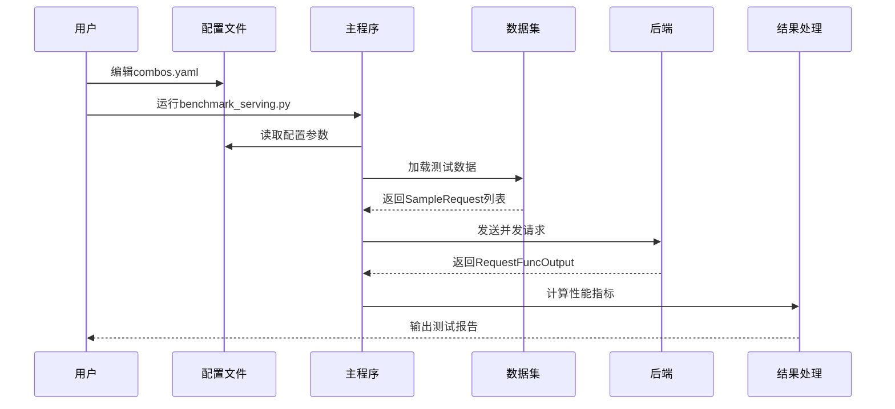
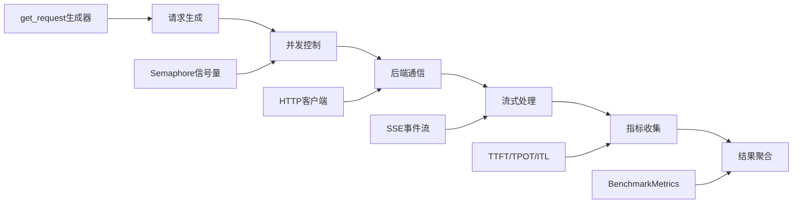

# 📚 vLLM基准测试框架代码结构详解

## 🎯 概述

本文档详细解释vLLM基准测试框架的代码结构、核心功能和实现原理，帮助初学者深入理解每个模块的作用和工作机制。

---

## 📁 核心文件结构

```
vllm_benchmark_serving/
├── 🔧 核心测试模块
│   ├── benchmark_serving.py          # 主测试程序 (1196行)
│   ├── backend_request_func.py       # 后端请求处理 (699行)
│   ├── benchmark_dataset.py          # 数据集处理 (1100行)
│   └── benchmark_utils.py            # 工具函数
├── 📊 数据分析模块
│   ├── aggregate_result.py           # 结果聚合
│   ├── benchmark_visualizer.py       # 可视化工具 (481行)
│   └── visualize.py                  # 可视化脚本
├── ⚙️ 配置和运行
│   ├── combos.yaml                   # 配置文件
│   ├── run_sweep.py                  # 批量运行脚本
│   └── requirements.txt              # 依赖文件
└── 📖 文档
    ├── README.md                     # 项目说明
    ├── BEGINNER_GUIDE.md            # 初学者指南
    └── USAGE_EXAMPLES.md            # 使用示例
```

---

## 🚀 核心模块详解

### 1. benchmark_serving.py - 主测试程序

这是整个框架的核心文件，包含了基准测试的主要逻辑。

#### 核心类和函数

##### BenchmarkMetrics 数据类
```python
@dataclass
class BenchmarkMetrics:
    """基准测试指标数据结构"""
    completed: int                    # 成功完成的请求数量
    total_input: int                  # 输入token总数
    total_output: int                 # 输出token总数
    request_throughput: float         # 请求吞吐量 (req/s)
    request_goodput: float            # 有效请求吞吐量 (满足SLA的req/s)
    output_throughput: float          # 输出token吞吐量 (token/s)
    total_token_throughput: float     # 总token吞吐量 (token/s)
    
    # 延迟指标 (毫秒)
    mean_ttft_ms: float              # TTFT平均值
    median_ttft_ms: float            # TTFT中位数
    std_ttft_ms: float               # TTFT标准差
    percentiles_ttft_ms: list        # TTFT百分位数
    
    # 类似的TPOT、ITL、E2EL指标...
```

##### get_request() - 请求生成器
```python
async def get_request(
    input_requests: list[SampleRequest],
    request_rate: float,
    burstiness: float = 1.0,
) -> AsyncGenerator[SampleRequest, None]:
    """
    异步请求生成器 - 控制请求发送的时机和模式
    
    核心功能：
    1. 按指定速率发送请求 (request_rate)
    2. 支持突发性控制 (burstiness)
    3. 模拟真实用户访问模式
    
    参数说明：
    - request_rate=inf: 批量模式，立即发送所有请求
    - request_rate=有限值: 流量控制模式，按速率发送
    - burstiness=1.0: 泊松过程 (指数分布间隔)
    - burstiness<1.0: 更突发的请求模式
    - burstiness>1.0: 更均匀的请求分布
    """
```

##### calculate_metrics() - 指标计算
```python
def calculate_metrics(
    input_requests: list[SampleRequest],
    outputs: list[RequestFuncOutput],
    dur_s: float,
    tokenizer: PreTrainedTokenizerBase,
    selected_percentile_metrics: list[str],
    selected_percentiles: list[float],
    goodput_config_dict: dict[str, float],
) -> tuple[BenchmarkMetrics, list[int]]:
    """
    计算基准测试性能指标
    
    核心计算逻辑：
    1. 统计成功/失败请求数量
    2. 计算各种延迟指标的统计值
    3. 计算吞吐量指标
    4. 计算百分位数分布
    5. 评估goodput (满足SLA的有效吞吐量)
    """
```

##### benchmark() - 主测试函数
```python
async def benchmark(...):
    """
    执行基准测试的核心异步函数
    
    测试流程：
    1. 预热测试 - 验证连接和配置
    2. 可选性能分析 - 启动profiler
    3. 并发请求执行 - 按配置发送请求
    4. 结果收集 - 等待所有请求完成
    5. 指标计算 - 统计性能数据
    6. 报告生成 - 输出格式化结果
    """
```

#### 关键设计模式

1. **异步并发**：使用asyncio实现高性能并发请求
2. **信号量控制**：通过Semaphore限制最大并发数
3. **流量控制**：支持多种请求发送模式
4. **错误处理**：完整的异常处理和错误统计

---

### 2. backend_request_func.py - 后端请求处理

这个模块实现了与不同推理后端的通信逻辑。

#### 核心数据结构

##### RequestFuncInput
```python
@dataclass
class RequestFuncInput:
    """请求输入数据结构"""
    prompt: str                       # 输入提示词
    api_url: str                      # API服务URL
    prompt_len: int                   # 提示词token长度
    output_len: int                   # 期望输出长度
    model: str                        # 模型名称
    logprobs: Optional[int] = None    # 对数概率数量
    multi_modal_content: Optional[dict] = None  # 多模态内容
    ignore_eos: bool = False          # 是否忽略EOS token
```

##### RequestFuncOutput
```python
@dataclass
class RequestFuncOutput:
    """请求输出数据结构"""
    generated_text: str = ""          # 生成的文本
    success: bool = False             # 请求是否成功
    latency: float = 0.0              # 总延迟时间
    output_tokens: int = 0            # 输出token数量
    ttft: float = 0.0                 # 首个token时间
    itl: list[float] = field(default_factory=list)  # token间延迟列表
    prompt_len: int = 0               # 输入长度
    error: str = ""                   # 错误信息
```

#### 后端支持

##### 支持的后端类型
```python
ASYNC_REQUEST_FUNCS = {
    "vllm": async_request_openai_completions,
    "vllm-chat": async_request_openai_chat_completions,
    "tgi": async_request_tgi,
    "tensorrt-llm": async_request_tensorrt_llm,
    "deepspeed-mii": async_request_deepspeed_mii,
    "openai": async_request_openai_completions,
    "openai-chat": async_request_openai_chat_completions,
    # ... 更多后端
}
```

##### 请求处理流程
1. **连接建立**：创建HTTP客户端连接
2. **请求构造**：根据后端格式构造请求体
3. **流式处理**：处理服务器端事件流 (SSE)
4. **指标收集**：实时收集TTFT、ITL等指标
5. **错误处理**：捕获和记录各种异常情况

---

### 3. benchmark_dataset.py - 数据集处理

这个模块提供了多种数据集的加载和处理功能。

#### 核心抽象类

##### BenchmarkDataset
```python
class BenchmarkDataset(ABC):
    """基准测试数据集抽象基类"""
    
    @abstractmethod
    def load_data(self) -> list:
        """加载原始数据"""
        pass
    
    @abstractmethod
    def sample(self, num_requests: int, **kwargs) -> list[SampleRequest]:
        """采样生成测试请求"""
        pass
```

#### 支持的数据集类型

##### 1. ShareGPTDataset - 对话数据集
```python
class ShareGPTDataset(BenchmarkDataset):
    """ShareGPT对话数据集处理类"""
    
    def sample(self, tokenizer, num_requests, output_len=None):
        """
        从ShareGPT数据中采样对话请求
        - 支持多轮对话处理
        - 自动计算输入输出长度
        - 支持输出长度覆盖
        """
```

##### 2. RandomDataset - 随机数据集
```python
class RandomDataset(BenchmarkDataset):
    """随机生成数据集，用于压力测试"""
    
    def sample(self, tokenizer, num_requests, input_len, output_len, **kwargs):
        """
        生成指定长度的随机token序列
        - 可控制输入输出长度
        - 支持长度范围随机化
        - 适用于极限性能测试
        """
```

##### 3. 多模态数据集
```python
class VisionArenaDataset(HuggingFaceDataset):
    """视觉对话竞技场数据集"""
    IS_MULTIMODAL = True
    
    def process_sample(self, sample):
        """
        处理包含图像的多模态样本
        - 图像编码和格式转换
        - 文本和图像内容整合
        - 支持多种图像格式
        """
```

#### 数据处理流程

1. **数据加载**：从文件或HuggingFace Hub加载原始数据
2. **数据清洗**：过滤无效或过长的样本
3. **格式转换**：转换为统一的SampleRequest格式
4. **长度计算**：使用tokenizer计算精确的token长度
5. **采样策略**：支持随机采样和过采样

---

### 4. benchmark_visualizer.py - 可视化工具

这个模块提供了丰富的数据可视化功能。

#### 核心功能

##### 1. 吞吐量分析
```python
def plot_throughput_analysis(self):
    """
    生成吞吐量分析图表
    - 并发数 vs 吞吐量关系
    - 输入长度对性能的影响
    - 时间序列趋势分析
    - 效率热力图
    """
```

##### 2. 延迟分析
```python
def plot_latency_analysis(self):
    """
    生成延迟分析图表
    - TTFT分布直方图
    - TPOT vs 并发数关系
    - 延迟组件对比
    - 百分位数分析
    """
```

##### 3. 交互式仪表板
```python
def plot_interactive_dashboard(self):
    """
    生成交互式HTML仪表板
    - 多维度数据筛选
    - 动态图表缩放
    - 悬停提示信息
    - 实时数据更新
    """
```

---

## 🔄 数据流向分析

### 1. 测试执行流程



### 2. 请求处理流程



---

## 🎯 关键算法实现

### 1. 请求速率控制算法

```python
# 使用伽马分布控制请求间隔
theta = 1.0 / (request_rate * burstiness)
interval = np.random.gamma(shape=burstiness, scale=theta)
await asyncio.sleep(interval)
```

**原理说明**：
- `burstiness=1.0`：退化为指数分布（泊松过程）
- `burstiness<1.0`：更突发的请求模式
- `burstiness>1.0`：更均匀的请求分布

### 2. 性能指标计算算法

```python
# TTFT: 首个token时间
ttft = first_token_timestamp - request_start_time

# TPOT: 每token时间 (排除首个token)
if output_len > 1:
    tpot = (total_latency - ttft) / (output_len - 1)

# ITL: token间延迟列表
itl = [t2 - t1 for t1, t2 in zip(timestamps[:-1], timestamps[1:])]

# E2EL: 端到端延迟
e2el = request_end_time - request_start_time
```

### 3. Goodput计算算法

```python
# 检查请求是否满足SLA要求
def is_good_request(ttft, tpot, e2el, sla_config):
    checks = []
    if 'ttft' in sla_config:
        checks.append(ttft <= sla_config['ttft'])
    if 'tpot' in sla_config:
        checks.append(tpot <= sla_config['tpot'])
    if 'e2el' in sla_config:
        checks.append(e2el <= sla_config['e2el'])
    return all(checks)

# Goodput = 满足SLA的请求数 / 总时间
goodput = good_requests_count / total_duration
```

---

## 🔧 扩展和定制

### 1. 添加新的后端支持

```python
async def async_request_custom_backend(
    request_func_input: RequestFuncInput,
    pbar: Optional[tqdm] = None,
) -> RequestFuncOutput:
    """自定义后端请求处理函数"""
    # 实现具体的请求逻辑
    pass

# 注册新后端
ASYNC_REQUEST_FUNCS["custom"] = async_request_custom_backend
```

### 2. 添加新的数据集类型

```python
class CustomDataset(BenchmarkDataset):
    """自定义数据集类"""
    
    def load_data(self):
        # 实现数据加载逻辑
        pass
    
    def sample(self, num_requests, **kwargs):
        # 实现采样逻辑
        return [SampleRequest(...) for _ in range(num_requests)]
```

### 3. 添加新的性能指标

```python
@dataclass
class ExtendedBenchmarkMetrics(BenchmarkMetrics):
    """扩展的性能指标"""
    custom_metric: float = 0.0
    
def calculate_extended_metrics(...):
    """计算扩展指标"""
    # 实现新指标的计算逻辑
    pass
```

---

## 📝 最佳实践

1. **代码组织**：保持模块化设计，单一职责原则
2. **异步编程**：合理使用asyncio，避免阻塞操作
3. **错误处理**：完整的异常捕获和错误记录
4. **性能优化**：使用适当的数据结构和算法
5. **可扩展性**：设计清晰的接口，便于功能扩展

通过本文档，开发者可以深入理解vLLM基准测试框架的内部实现，为进一步的开发和定制提供指导。
