# 🎓 大模型推理压测初学者完全指南

## 📚 什么是大模型推理压测？

大模型推理压测是评估大语言模型在实际部署环境中性能表现的重要手段。通过模拟真实用户请求，我们可以了解模型的：

- **响应速度**: 用户发送请求到收到回复的时间
- **处理能力**: 系统能同时处理多少个请求
- **稳定性**: 在高负载下系统是否稳定运行
- **资源利用率**: CPU、GPU、内存的使用效率

## 🎯 为什么需要压测？

### 1. 用户体验优化
- 确保用户获得流畅的对话体验
- 避免响应时间过长导致用户流失
- 优化系统配置以提供最佳性能

### 2. 成本控制
- 合理配置硬件资源，避免浪费
- 找到性价比最优的部署方案
- 预测扩容需求和成本

### 3. 系统稳定性
- 发现系统在高负载下的问题
- 验证系统的容错能力
- 制定合理的限流策略

## 🔧 核心概念解释

### 延迟指标 (Latency Metrics)

#### TTFT (Time To First Token) - 首次响应时间
```
用户: "你好，请介绍一下自己"
系统: [等待125ms] "你" [继续生成...]
      ↑
   TTFT = 125ms
```
- **含义**: 从发送请求到收到第一个字符的时间
- **重要性**: 直接影响用户感知的响应速度
- **优秀标准**: < 100ms (优秀), < 200ms (良好), > 500ms (需优化)

#### TPOT (Time Per Output Token) - 生成速度
```
系统生成: "你好，我是AI助手，很高兴为你服务"
每个字符间隔: 35ms
TPOT = 35ms
```
- **含义**: 生成每个字符/词的平均时间
- **重要性**: 影响整体对话的流畅度
- **优秀标准**: < 50ms (优秀), < 100ms (良好), > 200ms (需优化)

#### ITL (Inter-Token Latency) - 字符间延迟
```
"你" [30ms] "好" [40ms] "，" [35ms] "我" [32ms] ...
ITL = [30, 40, 35, 32, ...]
```
- **含义**: 相邻两个字符之间的时间间隔
- **重要性**: 反映流式输出的稳定性
- **分析方法**: 查看ITL的方差，方差越小越稳定

### 吞吐量指标 (Throughput Metrics)

#### Request Throughput - 请求处理能力
```
1秒内处理了22个用户请求
Request Throughput = 22 req/s
```
- **含义**: 系统每秒能处理多少个用户请求
- **重要性**: 决定系统能支撑多少并发用户
- **影响因素**: 硬件配置、模型大小、请求复杂度

#### Token Throughput - 文本生成速度
```
1秒内生成了2830个字符/词
Token Throughput = 2830 tok/s
```
- **含义**: 系统每秒能生成多少个字符/词
- **重要性**: 反映模型的实际生成效率
- **对比标准**: 不同模型和硬件配置差异很大

## 🛠️ 负载控制参数详解

### 1. `--max-concurrency`: 最大并发数 🔥 **核心参数**
```bash
--max-concurrency 50   # 最多同时处理50个请求
--max-concurrency 100  # 最多同时处理100个请求
```
- **含义**: 限制同时进行的请求数量，防止客户端压垮服务器
- **重要性**: 这是测试大模型并发能力的关键参数！
- **与request-rate的关系**:
  ```
  实际QPS = min(request-rate, 服务器处理能力)
  
  如果 max-concurrency 设置过小 → 限制了并发度 → QPS上不去
  如果 max-concurrency 设置过大 → 可能压垮服务器 → 请求失败
  ```

### 2. `--request-rate`: 请求发送速率 (req/s)
```bash
--request-rate inf     # 立即发送所有请求 (批量模式)
--request-rate 10      # 每秒发送10个请求 (流量控制模式)
--request-rate 0.5     # 每2秒发送1个请求 (低频测试)
```
- **含义**: 控制请求发送的时间间隔，模拟真实用户访问模式
- **两种模式对比**:

| 模式 | request-rate | 适用场景 | 优缺点 |
|------|-------------|----------|--------|
| 批量模式 | `inf` | 压力测试、最大性能测试 | ✅ 测试系统极限性能<br/>❌ 不符合真实使用场景 |
| 流量控制 | 有限值 | 真实场景模拟、稳定性测试 | ✅ 更真实的负载模式<br/>❌ 测试时间较长 |

### 3. `--num-prompts`: 总请求数量
```bash
--num-prompts 1000    # 发送1000个测试请求
```
- **含义**: 本次测试总共要发送多少个请求
- **影响**: 决定测试的样本量和测试时长
- **选择建议**:
  - 快速验证: 10-50个请求
  - 功能测试: 100-500个请求
  - 性能基准: 1000-5000个请求
  - 压力测试: 10000+个请求

## 🔍 `max-concurrency` 和 `num-prompts` 深度解析

### 📊 核心概念对比

很多初学者容易混淆这两个参数，让我们用表格清晰对比：

| 参数 | 含义 | 作用范围 | 影响因素 | 类比 |
|------|------|----------|----------|------|
| **`num-prompts`** | 测试请求总数量 | 整个测试的规模 | 测试时长、统计精度 | 餐厅一天要接待的总客人数 |
| **`max-concurrency`** | 最大并发请求数 | 同时执行的请求数量 | 服务器负载、响应时间 | 餐厅同时能容纳的客人数 |

不同参数组合的执行时间线对比

```mermaid
gantt
    title 不同参数组合的执行时间线对比
    dateFormat X
    axisFormat %s
    
    section 场景1: num-prompts=12, max-concurrency=4
    请求1-4 (第1批)    :active, batch1, 0, 3
    请求5-8 (第2批)    :batch2, 3, 6
    请求9-12 (第3批)   :batch3, 6, 9
    
    section 场景2: num-prompts=12, max-concurrency=2  
    请求1-2 (第1批)    :active, batch1_2, 0, 3
    请求3-4 (第2批)    :batch2_2, 3, 6
    请求5-6 (第3批)    :batch3_2, 6, 9
    请求7-8 (第4批)    :batch4_2, 9, 12
    请求9-10 (第5批)   :batch5_2, 12, 15
    请求11-12 (第6批)  :batch6_2, 15, 18
    
    section 场景3: num-prompts=12, max-concurrency=12
    请求1-12 (全部)    :active, batch1_12, 0, 3
```


### 🎯 参数详细说明

#### 1. `num-prompts` - 测试请求总数量 📊

```python
# 示例：总共要发送100个请求进行测试
--num-prompts 100
```

**作用机制**：
- 决定测试的**总体规模**和**样本数量**
- 影响测试的**统计精度**（样本越多，结果越准确）
- 决定测试的**总体时长**

**选择策略**：
```bash
# 快速功能验证
--num-prompts 10-50

# 常规性能测试
--num-prompts 100-1000

# 精确基准测试
--num-prompts 1000-5000

# 长期稳定性测试
--num-prompts 10000+
```

#### 2. `max-concurrency` - 最大并发请求数 🚀

```python
# 示例：最多同时执行8个请求
--max-concurrency 8
```

**作用机制**：
- 控制**同时执行**的请求数量上限
- 通过信号量(Semaphore)机制实现并发控制
- 防止客户端**过载服务器**
- 直接影响**吞吐量**和**延迟**指标

**选择策略**：
```bash
# 单用户模拟
--max-concurrency 1-2

# 小团队负载
--max-concurrency 4-8

# 中等负载测试
--max-concurrency 16-32

# 高负载压力测试
--max-concurrency 64-128

# 极限压力测试
--max-concurrency 256+
```

### 🔄 执行流程图解

让我们通过具体示例来理解两个参数的协作关系：

#### 示例1：`num-prompts=12, max-concurrency=4`
```
时间线: 0s    3s    6s    9s
批次1:  [请求1][请求2][请求3][请求4] ← 同时执行4个
批次2:                              [请求5][请求6][请求7][请求8] ← 等前4个完成后执行
批次3:                                                      [请求9][请求10][请求11][请求12]

总时长: 约9秒 (3批次 × 3秒/批次)
```

#### 示例2：`num-prompts=12, max-concurrency=2`
```
时间线: 0s  3s  6s  9s  12s 15s 18s
批次1:  [请求1][请求2] ← 同时执行2个
批次2:              [请求3][请求4]
批次3:                      [请求5][请求6]
批次4:                              [请求7][请求8]
批次5:                                      [请求9][请求10]
批次6:                                              [请求11][请求12]

总时长: 约18秒 (6批次 × 3秒/批次)
```

#### 示例3：`num-prompts=12, max-concurrency=12`
```
时间线: 0s    3s
全部:   [请求1-12全部同时执行] ← 所有请求一起执行

总时长: 约3秒 (1批次 × 3秒)
```

### 📈 实际运行示例对比

#### 🔬 低并发长时间测试
```bash
python3 benchmark_serving.py \
  --num-prompts 1000 \
  --max-concurrency 4 \
  --request-rate 10
```

**执行特点**：
- ✅ 总共1000个请求
- ✅ 最多同时执行4个请求
- ✅ 每秒发送10个请求
- ⏱️ **测试时长**：约100秒
- 🎯 **适用场景**：模拟正常用户访问，测试稳定性

#### 🚀 高并发短时间测试
```bash
python3 benchmark_serving.py \
  --num-prompts 100 \
  --max-concurrency 32 \
  --request-rate inf
```

**执行特点**：
- ✅ 总共100个请求
- ✅ 最多同时执行32个请求
- ✅ 立即发送所有请求(批量模式)
- ⏱️ **测试时长**：约3-10秒
- 🎯 **适用场景**：压力测试，测试系统极限能力

#### ⚖️ 平衡配置测试
```bash
python3 benchmark_serving.py \
  --num-prompts 500 \
  --max-concurrency 16 \
  --request-rate 20
```

**执行特点**：
- ✅ 总共500个请求
- ✅ 最多同时执行16个请求
- ✅ 每秒发送20个请求
- ⏱️ **测试时长**：约25秒
- 🎯 **适用场景**：综合性能评估，生产环境模拟

## 🚀 大模型并发能力测试

### 什么是大模型的并发能力？
大模型的并发能力指系统能够**同时处理多少个用户请求**而不出现明显的性能下降或服务中断。

### 如何测试大模型支持多少路并发？

**方法1: 渐进式并发测试 (推荐)**
```bash
#!/bin/bash
# 测试不同并发度下的性能表现
for concurrency in 1 5 10 20 50 100 200 500; do
    echo "🧪 测试并发度: $concurrency"
    python benchmark_serving.py \
        --backend vllm \
        --model /path/to/model \
        --dataset-name random \
        --num-prompts 200 \
        --request-rate inf \
        --max-concurrency $concurrency \
        --random-input-len 512 \
        --random-output-len 128 \
        --result-filename "concurrency_${concurrency}.json"
    
    # 检查成功率
    success_rate=$(grep "Successful requests" log.txt | awk '{print $3}')
    if [ "$success_rate" -lt 190 ]; then  # 成功率 < 95%
        echo "⚠️  并发度 $concurrency 时成功率下降，可能接近系统极限"
        break
    fi
done
```

### 🔧 参数关系的核心逻辑

#### 1. 并发控制机制原理

```python
# 伪代码展示并发控制逻辑
import asyncio

# 创建信号量控制并发数
semaphore = asyncio.Semaphore(max_concurrency)

async def limited_request_func(request_input):
    async with semaphore:  # 获取信号量，限制并发
        return await send_request(request_input)

# 创建所有任务
tasks = []
for i in range(num_prompts):  # 创建num_prompts个任务
    task = asyncio.create_task(limited_request_func(request_input))
    tasks.append(task)

# 等待所有任务完成
results = await asyncio.gather(*tasks)
```

#### 2. 实际执行决策流程

```
开始测试
    ↓
还有未发送的请求吗？
    ↓ 是
当前并发数 < max_concurrency？
    ↓ 是                    ↓ 否
发送新请求              等待请求完成
    ↓                      ↓
并发数+1                并发数-1
    ↓                      ↓
    ←─────────────────────┘
    ↓ 否
等待所有请求完成
    ↓
计算性能指标
```

### 📊 不同配置的性能影响分析

#### 1. 对吞吐量的影响

| 配置场景 | num-prompts | max-concurrency | 预期吞吐量 | 测试时长 | 适用场景 |
|----------|-------------|------------------|------------|----------|----------|
| 低并发测试 | 1000 | 4 | 较低 | 较长 | 稳定性验证 |
| 中并发测试 | 1000 | 16 | 中等 | 中等 | 常规性能评估 |
| 高并发测试 | 1000 | 64 | 较高 | 较短 | 压力测试 |
| 极限测试 | 1000 | 256 | 最高/下降 | 最短/失败 | 极限能力探测 |

#### 2. 对延迟的影响规律

```python
# 一般规律（具体值取决于服务器性能）
低并发 (1-4):   TTFT: 80-150ms,  TPOT: 20-40ms   (稳定)
中并发 (8-16):  TTFT: 120-250ms, TPOT: 30-60ms   (轻微增加)
高并发 (32-64): TTFT: 200-500ms, TPOT: 50-120ms  (明显增加)
极限并发(128+): TTFT: 500ms+,    TPOT: 不稳定     (可能出现超时)
```

### 🎯 参数选择策略指南

#### 1. 根据测试目标选择

##### 🔍 **功能验证测试**
```bash
--num-prompts 10 --max-concurrency 1
```
- 🎯 **目标**: 验证基本功能是否正常
- ✨ **特点**: 单线程执行，快速验证
- ⏱️ **时长**: 1-2分钟

##### 📊 **性能基线测试**
```bash
--num-prompts 100 --max-concurrency 4
```
- 🎯 **目标**: 建立性能基线，获得稳定指标
- ✨ **特点**: 中等规模，结果稳定可重复
- ⏱️ **时长**: 5-10分钟

##### 🚀 **压力测试**
```bash
--num-prompts 1000 --max-concurrency 32
```
- 🎯 **目标**: 测试系统在高负载下的表现
- ✨ **特点**: 高并发，大规模请求
- ⏱️ **时长**: 10-30分钟

##### 🎯 **生产环境模拟**
```bash
--num-prompts 500 --max-concurrency 8 --request-rate 15
```
- 🎯 **目标**: 模拟真实用户访问模式
- ✨ **特点**: 控制请求速率，模拟真实负载
- ⏱️ **时长**: 30-60分钟

#### 2. 根据硬件配置选择

##### 💻 **单GPU服务器**
```bash
--max-concurrency 4-8
--num-prompts $((concurrency * 20))  # 样本数为并发数的20倍
```

##### 🖥️ **多GPU服务器 (2-4卡)**
```bash
--max-concurrency 16-32
--num-prompts $((concurrency * 15))
```

##### 🏢 **集群环境 (8卡+)**
```bash
--max-concurrency 64-128
--num-prompts $((concurrency * 10))
```

### 参数重要性排序

**对于测试大模型并发能力，参数重要性排序：**

1. **🥇 `--max-concurrency`** (最重要)
   - 直接控制并发度
   - 决定能测试到的最大并发数
   - 影响系统资源利用率

2. **🥈 `--request-rate`** (次重要)
   - 控制请求到达模式
   - 影响测试的真实性
   - 与并发度配合使用

3. **🥉 `--num-prompts`** (辅助)
   - 保证足够的样本量
   - 影响测试结果的统计意义
   - 通常设置为并发数的5-10倍

## 🎯 快速开始

### 第一步: 环境准备
```bash
# 安装依赖
pip install -r requirements.txt

# 设置DCU环境变量
export HIP_VISIBLE_DEVICES=0,1,2,3,4,5,6,7
```

### 第二步: 启动vLLM服务
```bash
vllm serve /path/to/your/model \
    --trust-remote-code \
    --dtype float16 \
    --max-model-len 32768 \
    -tp 8 \
    --gpu-memory-utilization 0.9 \
    --port 8000
```

### 第三步: 运行基准测试
```bash
# 基础测试
python benchmark_serving.py \
    --backend vllm \
    --model /path/to/your/model \
    --dataset-name random \
    --num-prompts 100 \
    --random-input-len 512 \
    --random-output-len 128

# 并发测试
python benchmark_serving.py \
    --backend vllm \
    --model /path/to/your/model \
    --dataset-name random \
    --num-prompts 1000 \
    --request-rate 20 \
    --max-concurrency 50 \
    --random-input-len 512 \
    --random-output-len 128
```

### 第四步: 结果分析
```bash
# 生成可视化图表
python visualize.py --throughput --latency

# 查看性能报告
python visualize.py --report
```

## 📊 结果解读

### 控制台输出解读
```
=============== Serving Benchmark Result ===============
Successful requests:                     1000      # ✅ 成功处理的请求数
Benchmark duration (s):                 45.23     # ⏱️ 总测试时间
Request throughput (req/s):              22.11     # 🚀 请求吞吐量
Output token throughput (tok/s):         2830.45   # ⚡ 输出吞吐量

----------------------- Time to First Token -----------------------
Mean TTFT (ms):                          125.34    # 📊 平均首次响应时间
P99 TTFT (ms):                          245.89     # 🔺 99%用户的响应时间
```

### 性能评估标准

| 指标 | 优秀 | 良好 | 需优化 |
|------|------|------|--------|
| TTFT | < 100ms | < 200ms | > 500ms |
| TPOT | < 50ms | < 100ms | > 200ms |
| 请求吞吐量 | > 20 req/s | > 10 req/s | < 5 req/s |
| 成功率 | > 99% | > 95% | < 90% |

## ⚠️ 常见误区和注意事项

### ❌ 常见误区

#### 1. **误区1**: 认为`max-concurrency`越大越好
```bash
# ❌ 错误思维
--max-concurrency 1000  # 认为并发越高性能越好
```
- **❌ 问题**: 过高的并发可能导致服务器过载，反而降低性能
- **✅ 正确做法**: 渐进式测试，找到最优并发数

#### 2. **误区2**: 认为`num-prompts`和`max-concurrency`应该相等
```bash
# ❌ 错误配置
--num-prompts 50 --max-concurrency 50  # 认为两者应该一致
```
- **❌ 问题**: 两者服务不同目的，不应该相等
- **✅ 正确理解**: `num-prompts`控制总量，`max-concurrency`控制并发度

#### 3. **误区3**: 忽略`request-rate`参数的影响
```bash
# ❌ 忽略请求速率
--max-concurrency 32  # 只关注并发数，忽略发送速率
```
- **❌ 问题**: `request-rate`和`max-concurrency`共同决定实际负载模式
- **✅ 正确理解**: 两个参数需要配合使用

#### 4. **误区4**: 样本数量不足导致结果不准确
```bash
# ❌ 样本太少
--num-prompts 10 --max-concurrency 32  # 样本数小于并发数
```
- **❌ 问题**: 统计样本不足，结果不具代表性
- **✅ 建议比例**: `num-prompts >= max-concurrency × 10`

### ✅ 最佳实践

#### 1. **渐进式测试策略**
```bash
#!/bin/bash
# 从低并发开始，逐步增加
for concurrency in 1 2 4 8 16 32 64; do
    echo "🧪 测试并发度: $concurrency"
    python3 benchmark_serving.py \
        --num-prompts $((concurrency * 20)) \
        --max-concurrency $concurrency \
        --request-rate inf \
        --save-result \
        --result-filename "test_c${concurrency}.json"

    # 检查成功率，如果下降则停止
    success_rate=$(grep "Successful requests" output.log | tail -1 | awk '{print $3}')
    expected=$((concurrency * 20))
    if [ "$success_rate" -lt $((expected * 95 / 100)) ]; then
        echo "⚠️ 成功率下降到95%以下，停止测试"
        break
    fi
done
```

#### 2. **合理的参数比例**
```bash
# ✅ 推荐配置模式
base_concurrency=16

# 快速验证 (1:5比例)
--num-prompts $((base_concurrency * 5)) --max-concurrency $base_concurrency

# 常规测试 (1:10比例)
--num-prompts $((base_concurrency * 10)) --max-concurrency $base_concurrency

# 精确测试 (1:20比例)
--num-prompts $((base_concurrency * 20)) --max-concurrency $base_concurrency
```

#### 3. **监控系统资源**
```bash
# 测试时同时监控系统资源
# 终端1: 运行测试
python3 benchmark_serving.py --max-concurrency 32 --num-prompts 640

# 终端2: 监控GPU
watch -n 1 nvidia-smi

# 终端3: 监控CPU和内存
htop

# 终端4: 监控网络
iftop
```

#### 4. **结果验证和对比**
```bash
# 多次运行同样配置，验证结果稳定性
for run in 1 2 3; do
    python3 benchmark_serving.py \
        --num-prompts 200 \
        --max-concurrency 16 \
        --save-result \
        --result-filename "stability_run${run}.json"
done

# 对比结果差异
python3 compare_results.py stability_run*.json
```

### 🔬 实验对比示例

让我们通过实际实验来展示不同参数组合的效果：

#### 实验1: 固定总请求数，变化并发数
```bash
# 目标：观察并发数对性能的影响
base_requests=400

for concurrency in 1 4 8 16 32; do
    echo "🧪 实验1 - 并发数: $concurrency"
    python3 benchmark_serving.py \
        --num-prompts $base_requests \
        --max-concurrency $concurrency \
        --request-rate inf \
        --save-result \
        --result-filename "exp1_c${concurrency}.json"
done
```

**预期结果分析**：
- **吞吐量**: 随并发数增加而提升，直到达到服务器瓶颈
- **延迟**: 在低并发时较低，高并发时可能增加
- **成功率**: 在合理范围内应保持100%

#### 实验2: 固定并发数，变化总请求数
```bash
# 目标：观察样本数量对结果稳定性的影响
base_concurrency=16

for requests in 50 100 200 500 1000; do
    echo "🧪 实验2 - 请求数: $requests"
    python3 benchmark_serving.py \
        --num-prompts $requests \
        --max-concurrency $base_concurrency \
        --request-rate inf \
        --save-result \
        --result-filename "exp2_n${requests}.json"
done
```

**预期结果分析**：
- **平均指标**: 随样本增加趋于稳定
- **标准差**: 样本越多，标准差越小，结果越可靠
- **测试时长**: 与请求数成正比

## 🔧 常见问题与解答

### Q1: 如何找到系统的最大并发数？
**A**: 使用渐进式测试方法：
1. 从低并发开始 (如1、2、4)
2. 逐步增加并发数 (8、16、32、64)
3. 观察关键指标变化：
   - 成功率 < 95% → 接近极限
   - TTFT > 1000ms → 响应过慢
   - 吞吐量不再增长 → 达到瓶颈

### Q2: `num-prompts`设置多少合适？
**A**: 根据测试目的选择：
- **功能验证**: 10-50个请求
- **性能测试**: `max-concurrency × 10-20`
- **基准测试**: 1000+个请求
- **稳定性测试**: 5000+个请求

### Q3: 三个参数哪个最重要？
**A**: 重要性排序：
1. **`max-concurrency`** - 直接控制并发能力测试
2. **`request-rate`** - 控制负载模式真实性
3. **`num-prompts`** - 保证统计结果可靠性

### Q4: 如何选择合适的测试参数？
**A**: 根据业务场景选择：
- **在线客服**: 中等并发 (8-16)，模拟用户咨询
- **内容生成**: 高并发 (32-64)，批量处理需求
- **代码助手**: 低并发 (2-8)，交互式使用
- **API服务**: 根据预期QPS设置并发数

### Q5: 测试结果不稳定怎么办？
**A**: 检查以下方面：
1. **增加样本数量**: `num-prompts`至少是`max-concurrency`的10倍
2. **多次运行**: 运行3-5次取平均值
3. **检查系统资源**: 确保GPU/CPU/内存充足
4. **稳定测试环境**: 避免其他程序干扰

通过这个详细的参数解析指南，初学者可以深入理解并正确使用vLLM基准测试框架！
