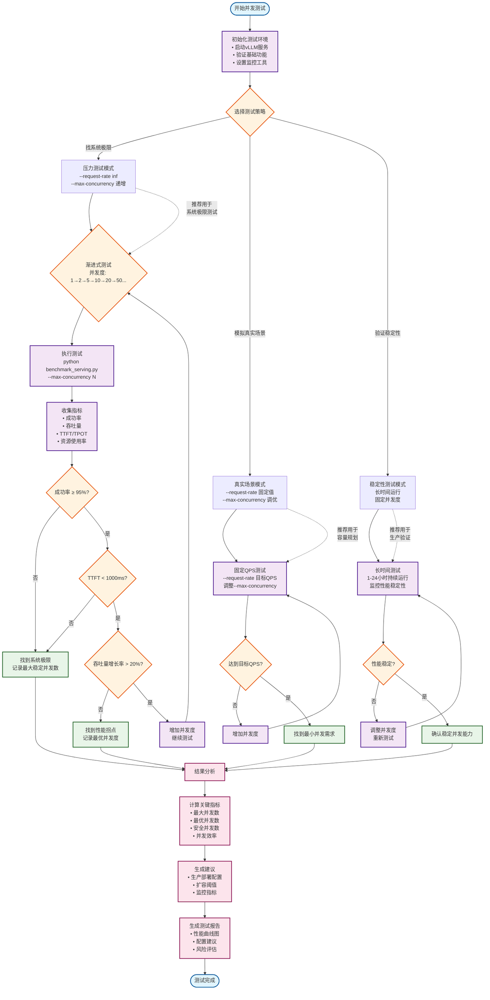

# 海光DCU大模型推理性能基准测试工具

## 项目概述

这是一个专门为海光DCU优化的vLLM大模型推理性能测试工具包，基于vLLM 0.8.5版本开发。该工具提供了完整的大模型推理性能评估解决方案，支持多种测试场景和详细的性能指标分析。

## 主要特性

### 🚀 DCU硬件优化
- 针对海光DCU硬件进行了深度优化
- 支持多卡DCU张量并行推理
- 优化的NCCL通信配置
- NUMA绑定优化，提升内存访问效率

### 📊 全面的性能指标
- **吞吐量指标**: 请求吞吐量、输出吞吐量、总token吞吐量
- **延迟指标**: TTFT (首次token时间)、TPOT (每token时间)、ITL (迭代延迟)、E2EL (端到端延迟)
- **统计分析**: 均值、中位数、标准差、百分位数 (P50, P90, P95, P99)
- **服务质量**: Goodput指标，评估满足SLO的请求比例

### 🔧 灵活的测试配置
- 支持多种批次大小测试 (1-64)
- 可配置的输入输出长度组合
- 多种数据集支持 (Random, ShareGPT, Sonnet等)
- 请求速率和并发控制

### 🌐 多后端支持
- vLLM (主要目标)
- TGI (Text Generation Inference)
- TensorRT-LLM
- OpenAI兼容API
- 其他推理后端

## 项目结构

```
vllm_benchmark_for_dcu/
├── code/                           # 核心代码目录
│   ├── benchmark_serving.py       # 主测试脚本 - 核心基准测试逻辑
│   ├── backend_request_func.py    # 后端请求处理 - 多后端统一接口
│   ├── benchmark_dataset.py       # 数据集处理 - 测试数据生成和管理
│   ├── benchmark_utils.py         # 工具函数 - 结果格式化和数据处理
│   ├── server.sh                  # vLLM服务启动脚本
│   ├── test.sh                    # 自动化测试脚本
│   └── log/                       # 测试日志目录
├── 大模型性能测试指南.md           # 详细使用指南
└── README.md                      # 项目说明文档
```

vLLM基准测试系统架构图
```mermaid
graph TB
    %% 用户输入层
    subgraph "用户输入层 (User Input Layer)"
        CLI[命令行参数<br/>--backend, --model, --dataset-name<br/>--num-prompts, --request-rate]
        CONFIG[配置文件<br/>test.sh, server.sh]
    end

    %% 数据集层
    subgraph "数据集层 (Dataset Layer)"
        SHAREGPT[ShareGPT数据集<br/>真实对话数据]
        RANDOM[Random数据集<br/>随机生成数据]
        SONNET[Sonnet数据集<br/>莎士比亚诗歌]
        HF[HuggingFace数据集<br/>多种开源数据集]
        BURSTGPT[BurstGPT数据集<br/>突发请求模式]
    end

    %% 请求处理层
    subgraph "请求处理层 (Request Processing Layer)"
        SAMPLER[数据采样器<br/>SampleRequest生成]
        GENERATOR[请求生成器<br/>get_request()函数<br/>支持泊松/伽马分布]
        SCHEDULER[并发调度器<br/>asyncio.Semaphore<br/>控制最大并发数]
    end

    %% 后端通信层
    subgraph "后端通信层 (Backend Communication Layer)"
        VLLM_BACKEND[vLLM后端<br/>OpenAI兼容API]
        TGI_BACKEND[TGI后端<br/>Text Generation Inference]
        OPENAI_BACKEND[OpenAI后端<br/>官方API]
        CUSTOM_BACKEND[自定义后端<br/>其他推理服务]
    end

    %% 推理服务层
    subgraph "推理服务层 (Inference Service Layer)"
        VLLM_SERVER[vLLM服务器<br/>多卡DCU张量并行<br/>FP16精度优化]
        MODEL[大语言模型<br/>DeepSeek-R1-AWQ<br/>32K上下文长度]
        DCU[海光DCU硬件<br/>8卡并行推理<br/>NCCL通信优化]
    end

    %% 性能分析层
    subgraph "性能分析层 (Performance Analysis Layer)"
        COLLECTOR[数据收集器<br/>RequestFuncOutput]
        CALCULATOR[指标计算器<br/>calculate_metrics()函数]
        METRICS[性能指标<br/>TTFT, TPOT, ITL, E2EL<br/>吞吐量, 百分位数]
    end

    %% 结果输出层
    subgraph "结果输出层 (Output Layer)"
        CONSOLE[控制台输出<br/>实时性能报告]
        JSON[JSON文件<br/>详细测试结果]
        CSV[CSV文件<br/>汇总性能数据]
        LOG[日志文件<br/>详细执行日志]
    end

    %% 连接关系
    CLI --> SAMPLER
    CONFIG --> CLI
    
    SHAREGPT --> SAMPLER
    RANDOM --> SAMPLER
    SONNET --> SAMPLER
    HF --> SAMPLER
    BURSTGPT --> SAMPLER
    
    SAMPLER --> GENERATOR
    GENERATOR --> SCHEDULER
    
    SCHEDULER --> VLLM_BACKEND
    SCHEDULER --> TGI_BACKEND
    SCHEDULER --> OPENAI_BACKEND
    SCHEDULER --> CUSTOM_BACKEND
    
    VLLM_BACKEND --> VLLM_SERVER
    TGI_BACKEND --> VLLM_SERVER
    OPENAI_BACKEND --> VLLM_SERVER
    CUSTOM_BACKEND --> VLLM_SERVER
    
    VLLM_SERVER --> MODEL
    MODEL --> DCU
    
    VLLM_BACKEND --> COLLECTOR
    TGI_BACKEND --> COLLECTOR
    OPENAI_BACKEND --> COLLECTOR
    CUSTOM_BACKEND --> COLLECTOR
    
    COLLECTOR --> CALCULATOR
    CALCULATOR --> METRICS
    
    METRICS --> CONSOLE
    METRICS --> JSON
    METRICS --> CSV
    METRICS --> LOG

    %% 样式定义
    classDef inputLayer fill:#e1f5fe
    classDef datasetLayer fill:#f3e5f5
    classDef processLayer fill:#e8f5e8
    classDef backendLayer fill:#fff3e0
    classDef serviceLayer fill:#fce4ec
    classDef analysisLayer fill:#f1f8e9
    classDef outputLayer fill:#e0f2f1

    class CLI,CONFIG inputLayer
    class SHAREGPT,RANDOM,SONNET,HF,BURSTGPT datasetLayer
    class SAMPLER,GENERATOR,SCHEDULER processLayer
    class VLLM_BACKEND,TGI_BACKEND,OPENAI_BACKEND,CUSTOM_BACKEND backendLayer
    class VLLM_SERVER,MODEL,DCU serviceLayer
    class COLLECTOR,CALCULATOR,METRICS analysisLayer
    class CONSOLE,JSON,CSV,LOG outputLayer
```

基准测试数据流程图
```mermaid
graph TD
    %% 原始数据层
    subgraph "原始数据层 (Raw Data Layer)"
        REQUEST[请求数据<br/>SampleRequest<br/>• prompt_len<br/>• expected_output_len]
        RESPONSE[响应数据<br/>RequestFuncOutput<br/>• success<br/>• generated_text<br/>• output_tokens<br/>• latency<br/>• ttft<br/>• itl[]]
    end

    %% 基础指标层
    subgraph "基础指标层 (Basic Metrics Layer)"
        TTFT[TTFT 首次Token时间<br/>Time To First Token<br/>• 从请求到首个token<br/>• 反映响应速度<br/>• 单位: 毫秒]
        
        TPOT[TPOT 每Token时间<br/>Time Per Output Token<br/>• (latency - ttft) / (output_len - 1)<br/>• 反映生成速度<br/>• 单位: 毫秒]
        
        ITL[ITL 迭代延迟<br/>Inter-Token Latency<br/>• 相邻token间时间间隔<br/>• 反映流畅度<br/>• 单位: 毫秒]
        
        E2EL[E2EL 端到端延迟<br/>End-to-End Latency<br/>• 请求到完整响应时间<br/>• 反映总体性能<br/>• 单位: 毫秒]
    end

    %% 统计指标层
    subgraph "统计指标层 (Statistical Metrics Layer)"
        MEAN[平均值 Mean<br/>• 所有样本的算术平均<br/>• 反映整体水平]
        
        MEDIAN[中位数 Median<br/>• 50%分位数<br/>• 不受极值影响]
        
        STD[标准差 Std Dev<br/>• 衡量数据离散程度<br/>• 反映稳定性]
        
        PERCENTILES[百分位数 Percentiles<br/>• P90, P95, P99<br/>• 反映尾部性能<br/>• 评估最坏情况]
    end

    %% 吞吐量指标层
    subgraph "吞吐量指标层 (Throughput Metrics Layer)"
        REQ_THROUGHPUT[请求吞吐量<br/>Request Throughput<br/>• completed / duration<br/>• 单位: req/s]
        
        OUTPUT_THROUGHPUT[输出吞吐量<br/>Output Throughput<br/>• total_output_tokens / duration<br/>• 单位: tok/s]
        
        TOTAL_THROUGHPUT[总Token吞吐量<br/>Total Token Throughput<br/>• (input + output) / duration<br/>• 单位: tok/s]
        
        GOODPUT[良好吞吐量<br/>Request Goodput<br/>• 满足SLO的请求数/秒<br/>• 反映服务质量]
    end

    %% 服务质量指标层
    subgraph "服务质量指标层 (QoS Metrics Layer)"
        SLO[服务级别目标<br/>Service Level Objectives<br/>• TTFT < 100ms<br/>• TPOT < 50ms<br/>• E2EL < 1000ms]
        
        SUCCESS_RATE[成功率<br/>Success Rate<br/>• successful_requests / total_requests<br/>• 反映系统稳定性]
        
        QOS_SCORE[服务质量评分<br/>Quality of Service Score<br/>• 综合多项指标<br/>• 业务价值评估]
    end

    %% 业务指标层
    subgraph "业务指标层 (Business Metrics Layer)"
        USER_EXPERIENCE[用户体验指标<br/>User Experience<br/>• 响应速度感知<br/>• 交互流畅度]
        
        COST_EFFICIENCY[成本效率<br/>Cost Efficiency<br/>• 每token处理成本<br/>• 硬件利用率]
        
        SCALABILITY[可扩展性<br/>Scalability<br/>• 负载承受能力<br/>• 性能线性度]
    end

    %% 数据流连接
    REQUEST --> TTFT
    REQUEST --> TPOT
    REQUEST --> ITL
    REQUEST --> E2EL
    
    RESPONSE --> TTFT
    RESPONSE --> TPOT
    RESPONSE --> ITL
    RESPONSE --> E2EL
    
    TTFT --> MEAN
    TTFT --> MEDIAN
    TTFT --> STD
    TTFT --> PERCENTILES
    
    TPOT --> MEAN
    TPOT --> MEDIAN
    TPOT --> STD
    TPOT --> PERCENTILES
    
    ITL --> MEAN
    ITL --> MEDIAN
    ITL --> STD
    ITL --> PERCENTILES
    
    E2EL --> MEAN
    E2EL --> MEDIAN
    E2EL --> STD
    E2EL --> PERCENTILES
    
    RESPONSE --> REQ_THROUGHPUT
    RESPONSE --> OUTPUT_THROUGHPUT
    RESPONSE --> TOTAL_THROUGHPUT
    
    TTFT --> SLO
    TPOT --> SLO
    E2EL --> SLO
    SLO --> GOODPUT
    
    RESPONSE --> SUCCESS_RATE
    SUCCESS_RATE --> QOS_SCORE
    GOODPUT --> QOS_SCORE
    
    TTFT --> USER_EXPERIENCE
    ITL --> USER_EXPERIENCE
    
    OUTPUT_THROUGHPUT --> COST_EFFICIENCY
    TOTAL_THROUGHPUT --> COST_EFFICIENCY
    
    REQ_THROUGHPUT --> SCALABILITY
    PERCENTILES --> SCALABILITY

    %% 关键关系标注
    TTFT -.->|影响| USER_EXPERIENCE
    TPOT -.->|影响| COST_EFFICIENCY
    ITL -.->|影响| USER_EXPERIENCE
    PERCENTILES -.->|评估| SCALABILITY
    
    %% 样式定义
    classDef rawData fill:#ffebee,stroke:#c62828,stroke-width:2px
    classDef basicMetrics fill:#e8f5e8,stroke:#2e7d32,stroke-width:2px
    classDef statMetrics fill:#e3f2fd,stroke:#1565c0,stroke-width:2px
    classDef throughputMetrics fill:#fff3e0,stroke:#ef6c00,stroke-width:2px
    classDef qosMetrics fill:#f3e5f5,stroke:#7b1fa2,stroke-width:2px
    classDef businessMetrics fill:#e0f2f1,stroke:#00695c,stroke-width:2px
    
    class REQUEST,RESPONSE rawData
    class TTFT,TPOT,ITL,E2EL basicMetrics
    class MEAN,MEDIAN,STD,PERCENTILES statMetrics
    class REQ_THROUGHPUT,OUTPUT_THROUGHPUT,TOTAL_THROUGHPUT,GOODPUT throughputMetrics
    class SLO,SUCCESS_RATE,QOS_SCORE qosMetrics
    class USER_EXPERIENCE,COST_EFFICIENCY,SCALABILITY businessMetrics
```

性能指标关系图
```mermaid
graph TD
    %% 原始数据层
    subgraph "原始数据层 (Raw Data Layer)"
        REQUEST[请求数据<br/>SampleRequest<br/>• prompt_len<br/>• expected_output_len]
        RESPONSE[响应数据<br/>RequestFuncOutput<br/>• success<br/>• generated_text<br/>• output_tokens<br/>• latency<br/>• ttft<br/>• itl[]]
    end

    %% 基础指标层
    subgraph "基础指标层 (Basic Metrics Layer)"
        TTFT[TTFT 首次Token时间<br/>Time To First Token<br/>• 从请求到首个token<br/>• 反映响应速度<br/>• 单位: 毫秒]
        
        TPOT[TPOT 每Token时间<br/>Time Per Output Token<br/>• (latency - ttft) / (output_len - 1)<br/>• 反映生成速度<br/>• 单位: 毫秒]
        
        ITL[ITL 迭代延迟<br/>Inter-Token Latency<br/>• 相邻token间时间间隔<br/>• 反映流畅度<br/>• 单位: 毫秒]
        
        E2EL[E2EL 端到端延迟<br/>End-to-End Latency<br/>• 请求到完整响应时间<br/>• 反映总体性能<br/>• 单位: 毫秒]
    end

    %% 统计指标层
    subgraph "统计指标层 (Statistical Metrics Layer)"
        MEAN[平均值 Mean<br/>• 所有样本的算术平均<br/>• 反映整体水平]
        
        MEDIAN[中位数 Median<br/>• 50%分位数<br/>• 不受极值影响]
        
        STD[标准差 Std Dev<br/>• 衡量数据离散程度<br/>• 反映稳定性]
        
        PERCENTILES[百分位数 Percentiles<br/>• P90, P95, P99<br/>• 反映尾部性能<br/>• 评估最坏情况]
    end

    %% 吞吐量指标层
    subgraph "吞吐量指标层 (Throughput Metrics Layer)"
        REQ_THROUGHPUT[请求吞吐量<br/>Request Throughput<br/>• completed / duration<br/>• 单位: req/s]
        
        OUTPUT_THROUGHPUT[输出吞吐量<br/>Output Throughput<br/>• total_output_tokens / duration<br/>• 单位: tok/s]
        
        TOTAL_THROUGHPUT[总Token吞吐量<br/>Total Token Throughput<br/>• (input + output) / duration<br/>• 单位: tok/s]
        
        GOODPUT[良好吞吐量<br/>Request Goodput<br/>• 满足SLO的请求数/秒<br/>• 反映服务质量]
    end

    %% 服务质量指标层
    subgraph "服务质量指标层 (QoS Metrics Layer)"
        SLO[服务级别目标<br/>Service Level Objectives<br/>• TTFT < 100ms<br/>• TPOT < 50ms<br/>• E2EL < 1000ms]
        
        SUCCESS_RATE[成功率<br/>Success Rate<br/>• successful_requests / total_requests<br/>• 反映系统稳定性]
        
        QOS_SCORE[服务质量评分<br/>Quality of Service Score<br/>• 综合多项指标<br/>• 业务价值评估]
    end

    %% 业务指标层
    subgraph "业务指标层 (Business Metrics Layer)"
        USER_EXPERIENCE[用户体验指标<br/>User Experience<br/>• 响应速度感知<br/>• 交互流畅度]
        
        COST_EFFICIENCY[成本效率<br/>Cost Efficiency<br/>• 每token处理成本<br/>• 硬件利用率]
        
        SCALABILITY[可扩展性<br/>Scalability<br/>• 负载承受能力<br/>• 性能线性度]
    end

    %% 数据流连接
    REQUEST --> TTFT
    REQUEST --> TPOT
    REQUEST --> ITL
    REQUEST --> E2EL
    
    RESPONSE --> TTFT
    RESPONSE --> TPOT
    RESPONSE --> ITL
    RESPONSE --> E2EL
    
    TTFT --> MEAN
    TTFT --> MEDIAN
    TTFT --> STD
    TTFT --> PERCENTILES
    
    TPOT --> MEAN
    TPOT --> MEDIAN
    TPOT --> STD
    TPOT --> PERCENTILES
    
    ITL --> MEAN
    ITL --> MEDIAN
    ITL --> STD
    ITL --> PERCENTILES
    
    E2EL --> MEAN
    E2EL --> MEDIAN
    E2EL --> STD
    E2EL --> PERCENTILES
    
    RESPONSE --> REQ_THROUGHPUT
    RESPONSE --> OUTPUT_THROUGHPUT
    RESPONSE --> TOTAL_THROUGHPUT
    
    TTFT --> SLO
    TPOT --> SLO
    E2EL --> SLO
    SLO --> GOODPUT
    
    RESPONSE --> SUCCESS_RATE
    SUCCESS_RATE --> QOS_SCORE
    GOODPUT --> QOS_SCORE
    
    TTFT --> USER_EXPERIENCE
    ITL --> USER_EXPERIENCE
    
    OUTPUT_THROUGHPUT --> COST_EFFICIENCY
    TOTAL_THROUGHPUT --> COST_EFFICIENCY
    
    REQ_THROUGHPUT --> SCALABILITY
    PERCENTILES --> SCALABILITY

    %% 关键关系标注
    TTFT -.->|影响| USER_EXPERIENCE
    TPOT -.->|影响| COST_EFFICIENCY
    ITL -.->|影响| USER_EXPERIENCE
    PERCENTILES -.->|评估| SCALABILITY
    
    %% 样式定义
    classDef rawData fill:#ffebee,stroke:#c62828,stroke-width:2px
    classDef basicMetrics fill:#e8f5e8,stroke:#2e7d32,stroke-width:2px
    classDef statMetrics fill:#e3f2fd,stroke:#1565c0,stroke-width:2px
    classDef throughputMetrics fill:#fff3e0,stroke:#ef6c00,stroke-width:2px
    classDef qosMetrics fill:#f3e5f5,stroke:#7b1fa2,stroke-width:2px
    classDef businessMetrics fill:#e0f2f1,stroke:#00695c,stroke-width:2px
    
    class REQUEST,RESPONSE rawData
    class TTFT,TPOT,ITL,E2EL basicMetrics
    class MEAN,MEDIAN,STD,PERCENTILES statMetrics
    class REQ_THROUGHPUT,OUTPUT_THROUGHPUT,TOTAL_THROUGHPUT,GOODPUT throughputMetrics
    class SLO,SUCCESS_RATE,QOS_SCORE qosMetrics
    class USER_EXPERIENCE,COST_EFFICIENCY,SCALABILITY businessMetrics
```
大模型并发能力测试决策流程图


## 核心组件说明

### 1. benchmark_serving.py - 主测试脚本
- **功能**: 基准测试的核心控制逻辑
- **特性**: 
  - 异步请求处理，支持高并发测试
  - 详细的性能指标计算和统计分析
  - 灵活的测试参数配置
  - 完整的错误处理和日志记录

### 2. backend_request_func.py - 后端请求处理
- **功能**: 提供统一的多后端请求接口
- **特性**:
  - 支持多种推理后端的统一调用
  - 流式响应处理和性能指标收集
  - 异步HTTP通信优化
  - 完善的错误处理机制

### 3. benchmark_dataset.py - 数据集处理
- **功能**: 测试数据的生成和管理
- **特性**:
  - 支持多种数据集格式
  - 随机数据生成功能
  - 多模态数据支持
  - 灵活的数据采样策略

### 4. benchmark_utils.py - 工具函数
- **功能**: 结果处理和格式化工具
- **特性**:
  - PyTorch基准测试格式转换
  - JSON序列化优化
  - 数据清理和标准化

## 快速开始

### 1. 环境准备
```bash
# 使用指定的Docker镜像
docker run -it \
  --name=llm-benchmark \
  -v /data:/data \
  --ipc=host \
  --network=host \
  --device=/dev/kfd \
  --device=/dev/mkfd \
  --device=/dev/dri \
  --shm-size=64G \
  image.sourcefind.cn:5000/dcu/admin/base/vllm:0.8.5-ubuntu22.04-dtk25.04.1-rc5-das1.6-py3.10-20250711 \
  /bin/bash
```

### 2. 启动vLLM服务
```bash
# 修改server.sh中的模型路径，然后执行
bash server.sh
```

### 3. 运行基准测试
```bash
# 修改test.sh中的测试参数，然后执行
bash test.sh
```

### 4. 查看结果
- **汇总结果**: `r1-awq-0705.csv` - 包含所有测试配置的性能指标
- **详细日志**: `log/` 目录 - 每个测试配置的详细日志

## 性能指标说明

### 吞吐量指标
- **Request Throughput**: 每秒处理的请求数 (req/s)
- **Output Throughput**: 每秒生成的token数 (tok/s)  
- **Total Token Throughput**: 每秒处理的总token数 (tok/s)

### 延迟指标
- **TTFT (Time To First Token)**: 从请求到首个token的时间 (ms)
- **TPOT (Time Per Output Token)**: 生成每个token的平均时间 (ms)
- **ITL (Inter-Token Latency)**: token间的延迟 (ms)
- **E2EL (End-to-End Latency)**: 端到端总延迟 (ms)

## 测试配置建议

### 批次大小选择
- **小批次 (1-4)**: 测试低延迟场景
- **中批次 (8-16)**: 测试平衡性能场景  
- **大批次 (32-64)**: 测试高吞吐量场景

### 输入输出长度
- **短文本 (512/512)**: 测试快速响应场景
- **长文本 (1024/1024)**: 测试复杂推理场景
- **自定义长度**: 根据实际应用需求调整

## 注意事项

1. **硬件要求**: 确保有足够的DCU显存支持模型加载
2. **网络配置**: 确保vLLM服务端口可访问
3. **模型路径**: 正确配置模型文件路径
4. **环境变量**: 根据硬件配置调整DCU和NCCL相关环境变量

## 故障排除

### 常见问题
1. **显存不足**: 调整 `--gpu-memory-utilization` 参数
2. **端口冲突**: 修改 `--port` 参数
3. **模型加载失败**: 检查模型路径和权限
4. **通信错误**: 检查NCCL和网络配置

### 日志分析
- 查看 `log/` 目录下的详细日志文件
- 关注错误信息和性能警告
- 使用 `grep` 命令快速定位问题

## 贡献指南

欢迎提交Issue和Pull Request来改进这个工具。请确保：
1. 代码符合项目的编码规范
2. 添加适当的注释和文档
3. 测试新功能的兼容性

## 许可证

本项目采用Apache 2.0许可证，详见LICENSE文件。
